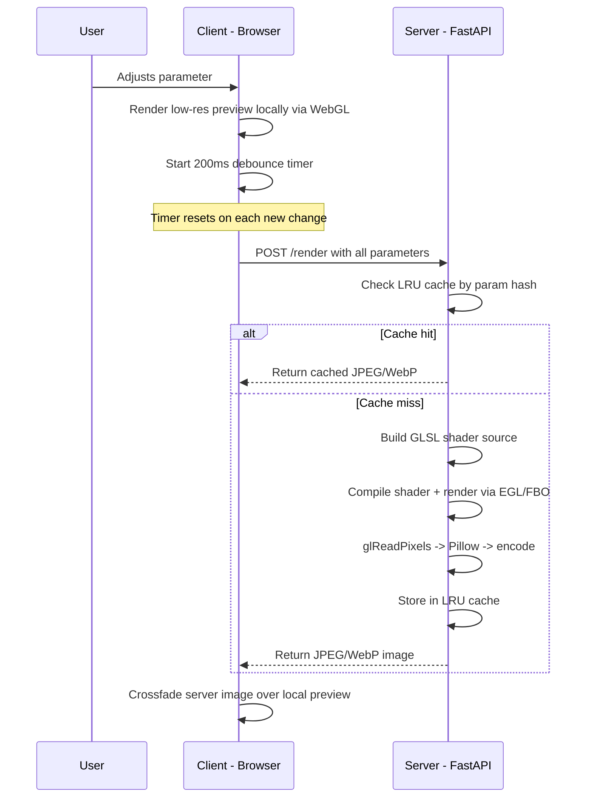
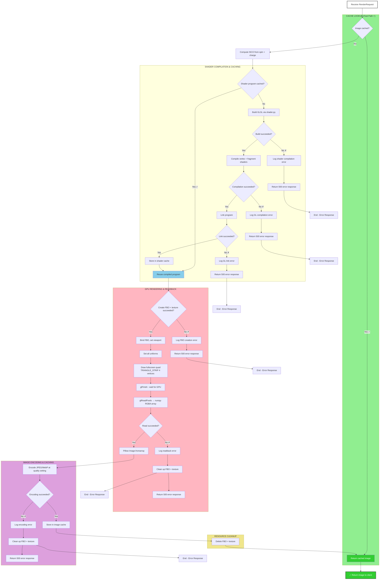

# Nulltracer — Server-Side Rendering Architecture

## 1. Overview

This document describes the hybrid rendering architecture for Nulltracer, enabling mobile and low-performance devices to receive high-quality black hole renders from a GPU-equipped server while maintaining instant local previews.

### Design Principles

- **Progressive enhancement** — the client works fully offline; server rendering is an optional upgrade
- **Visual continuity** — low-res local preview appears instantly, server image crossfades over it
- **Shader parity** — the server uses the *exact same GLSL source* as the client, generated by a Python port of `buildFragSrc()`
- **Stateless API** — each render request is self-contained; the server caches results by parameter hash

### Hybrid Rendering Flow



---

## 2. Server Component

### 2.1 Directory Structure

```
nulltracer/server/
├── app.py                 # FastAPI application entry point
├── shader.py              # Thin orchestrator composing shader from modules
├── shader_base.py         # Common shader header, defines, uniforms, shared geoRHS()
├── backgrounds.py         # Background GLSL functions (bgStars, bgChecker, bgColorMap, disk)
├── integrators/           # Modular integrator system
│   ├── __init__.py        # Integrator registry mapping names to generator functions
│   ├── rk4.py             # RK4 integrator (4th-order Runge-Kutta)
│   ├── yoshida4.py        # Yoshida 4th-order symplectic integrator
│   ├── yoshida6.py        # Yoshida 6th-order symplectic integrator
│   ├── yoshida8.py        # Yoshida 8th-order symplectic integrator
│   └── rkdp8.py           # Dormand-Prince 8th-order adaptive integrator
├── renderer.py            # EGL context management + OpenGL rendering
├── isco.py                # ISCO calculation (port of iscoJS/iscoKN)
├── cache.py               # LRU cache keyed on parameter hash
├── Dockerfile             # GPU-enabled container definition
├── requirements.txt       # Python dependencies
└── tests/
    ├── test_shader.py     # Verify shader output matches JS version
    ├── test_isco.py       # Verify ISCO values match JS version
    └── test_renderer.py   # Integration test for render pipeline
```

### 2.2 FastAPI Application (`app.py`)

```python
# Pseudocode structure
from fastapi import FastAPI
from fastapi.middleware.cors import CORSMiddleware
from fastapi.responses import Response

app = FastAPI(title="Nulltracer Render Server")

app.add_middleware(
    CORSMiddleware,
    allow_origins=["*"],          # Tighten in production
    allow_methods=["POST", "GET"],
    allow_headers=["*"],
)

@app.get("/health")
async def health():
    return {"status": "ok", "gpu": renderer.gpu_name()}

@app.post("/render")
async def render(params: RenderRequest) -> Response:
    # 1. Compute cache key from params
    # 2. Check LRU cache
    # 3. On miss: acquire render lock, build shader, render, encode
    # 4. Return image bytes with Content-Type header
    ...
```

**Startup**: On application startup (`@app.on_event("startup")`), initialize the EGL display and context once. This context persists for the lifetime of the process.

**Shutdown**: On shutdown, destroy the EGL context and release GPU resources.

### 2.3 Shader Generation (Modular Architecture)

The shader generation pipeline has been refactored into a modular system with separate concerns:

#### Orchestrator: `shader.py`

A **thin orchestrator** that composes the complete fragment shader from multiple modules. It imports from:
- [`shader_base.py`](server/shader_base.py) — Common header, `#define` constants, uniforms, shared `geoRHS()` function
- [`backgrounds.py`](server/backgrounds.py) — Background GLSL functions (bgStars, bgChecker, bgColorMap, disk)
- [`integrators/`](server/integrators/) — Integrator-specific GLSL code generators

The main entry point:

```python
def build_frag_src(
    steps: int = 200,
    method: str = "separated",
    obs_dist: float = 40.0,
    star_layers: int = 3,
    step_size: float = 0.30,
    bg_mode: int = 1,
) -> str:
    """Return complete GLSL fragment shader source."""
    # Compose from modules
    parts = [
        base_header(),  # from shader_base
        define_uniforms(),  # from shader_base
        background_functions(),  # from backgrounds
        integrator_main_loop(),  # from integrators[method]
    ]
    return "\n".join(parts)
```

#### Shader Base: `shader_base.py`

Contains the common shader infrastructure:
- GLSL version directive and compatibility header
- `#define` compile-time constants (STEPS, R0, RESC, RDISK, H_BASE, etc.)
- Uniform declarations (u_res, u_a, u_incl, u_fov, u_disk, etc.)
- Shared mathematical functions: `geoRHS()` for geodesic equations

**Compile-time `#define` constants** (baked into shader source, require recompilation when changed):

| Define | Source Parameter | Default | Description |
|--------|-----------------|---------|-------------|
| `STEPS` | `steps` | 200 | Integration step count |
| `R0` | `obsDist` | 40.0 | Observer distance in M |
| `RESC` | derived: `obsDist + 12` | 52.0 | Escape radius |
| `RDISK` | hardcoded | 14.0 | Outer disk radius |
| `H_BASE` | `stepSize` | 0.30 | Base step size |
| `STAR_LAYERS` | `starLayers` | 3 | Background star layer count |
| `BG_MODE` | `bgMode` | 1 | Background type: 0=stars, 1=checker, 2=colormap |
| `S2_EPS` | hardcoded | 0.0004 | Pole regularization epsilon |

**Runtime uniforms** (set per-render without recompilation):

| Uniform | Type | Source |
|---------|------|--------|
| `u_res` | `vec2` | Render resolution (width, height) |
| `u_a` | `float` | Spin parameter |
| `u_incl` | `float` | Inclination in **radians** (convert from degrees) |
| `u_fov` | `float` | Field of view |
| `u_disk` | `float` | Show disk: 1.0 or 0.0 |
| `u_grid` | `float` | Show grid: 1.0 or 0.0 |
| `u_temp` | `float` | Disk temperature multiplier |
| `u_phi0` | `float` | Rotation angle (always 0.0 for server renders) |
| `u_Q` | `float` | Electric charge parameter |
| `u_isco` | `float` | ISCO radius (computed by [`isco.py`](server/isco.py)) |

#### Backgrounds: `backgrounds.py`

Provides environment rendering functions:
- `bgStars()` — Procedural star field with depth layers
- `bgChecker()` — Checkerboard pattern background
- `bgColorMap()` — Gradient-based color mapping
- Disk color/temperature functions

#### Integrators: `integrators/` Module System

A registry-based plugin system for numerical integration schemes. Each integrator is a separate module implementing the geodesic integration main loop.

**Integrator registry** ([`integrators/__init__.py`](server/integrators/__init__.py)):

```python
INTEGRATORS = {
    "rk4": get_rk4_loop,
    "yoshida4": get_yoshida4_loop,
    "yoshida6": get_yoshida6_loop,
    "yoshida8": get_yoshida8_loop,
    "rkdp8": get_rkdp8_loop,
}
```

The `method` parameter selects from this registry:

| Method | Module | Description |
|--------|--------|-------------|
| `"rk4"` | [`rk4.py`](server/integrators/rk4.py) | 4th-order Runge-Kutta integrator |
| `"yoshida4"` | [`yoshida4.py`](server/integrators/yoshida4.py) | 4th-order symplectic integrator |
| `"yoshida6"` | [`yoshida6.py`](server/integrators/yoshida6.py) | 6th-order symplectic integrator |
| `"yoshida8"` | [`yoshida8.py`](server/integrators/yoshida8.py) | 8th-order symplectic integrator |
| `"rkdp8"` | [`rkdp8.py`](server/integrators/rkdp8.py) | Dormand-Prince adaptive 8th-order integrator |

Each integrator module exports a function that returns the GLSL main loop code as a string. The orchestrator (`shader.py`) composes the complete shader by selecting the appropriate integrator module.

**Benefits of modular integrators:**
- **Separation of concerns** — Each integrator algorithm is isolated in its own module
- **Easy extension** — Adding a new integrator requires only adding a new module to `integrators/`
- **Code reuse** — All integrators share `geoRHS()` and other common functions from `shader_base.py`
- **Reduced duplication** — Formerly all integrators were inline in a single 53KB shader.py

**Vertex shader** is trivial and constant:

```glsl
attribute vec2 a_pos;
varying vec2 v_uv;
void main(){ v_uv=a_pos; gl_Position=vec4(a_pos,0,1); }
```

For desktop OpenGL (non-ES), the server must prepend `#version 120` or use compatibility profile so that `attribute`/`varying`/`gl_FragColor` syntax works. Alternatively, translate to `#version 330 core` with `in`/`out` — but this risks divergence from the client shader. **Recommendation**: Use OpenGL 2.1 compatibility profile or GLES 2.0 via EGL to keep the shader source identical.

### 2.4 ISCO Calculation (`isco.py`)

A direct port of the JavaScript [`iscoJS()`](nulltracer/index.html:942) and [`iscoKN()`](nulltracer/index.html:861) functions.

**Logic**:
1. If `Q == 0`: use the analytic Kerr formula (Bardeen, Press & Teukolsky 1972)
2. If `Q != 0`: use numerical bisection on `dE/dr = 0` for Kerr-Newman

The ISCO value is computed server-side and passed as the `u_isco` uniform. This avoids any discrepancy between client and server ISCO values.

**Validation**: The test suite must verify that `isco.py` matches `iscoJS()` output for a matrix of `(a, Q)` values to within `1e-6` relative error.

### 2.5 EGL/OpenGL Headless Rendering Pipeline (`renderer.py`)

#### Context Creation

```python
# Pseudocode for EGL headless context
import ctypes
from OpenGL import EGL, GL

def create_egl_context():
    # 1. Get default display (EGL_DEFAULT_DISPLAY for headless)
    display = EGL.eglGetDisplay(EGL.EGL_DEFAULT_DISPLAY)
    EGL.eglInitialize(display, None, None)

    # 2. Choose config: GLES 2.0 compatible, pbuffer surface
    config_attribs = [
        EGL.EGL_SURFACE_TYPE, EGL.EGL_PBUFFER_BIT,
        EGL.EGL_RENDERABLE_TYPE, EGL.EGL_OPENGL_BIT,  # or EGL_OPENGL_ES2_BIT
        EGL.EGL_RED_SIZE, 8,
        EGL.EGL_GREEN_SIZE, 8,
        EGL.EGL_BLUE_SIZE, 8,
        EGL.EGL_ALPHA_SIZE, 8,
        EGL.EGL_NONE,
    ]
    config = choose_config(display, config_attribs)

    # 3. Bind OpenGL API (not GLES — for compatibility profile)
    EGL.eglBindAPI(EGL.EGL_OPENGL_API)

    # 4. Create context
    context = EGL.eglCreateContext(display, config, EGL.EGL_NO_CONTEXT, None)

    # 5. Create pbuffer surface (1x1 — we render to FBO)
    pbuffer_attribs = [EGL.EGL_WIDTH, 1, EGL.EGL_HEIGHT, 1, EGL.EGL_NONE]
    surface = EGL.eglCreatePbufferSurface(display, config, pbuffer_attribs)

    # 6. Make current
    EGL.eglMakeCurrent(display, surface, surface, context)

    return display, surface, context
```

**Alternative**: If EGL proves problematic, use `EGL_EXT_platform_device` for truly headless GPU rendering (no X11/Wayland needed). This is the preferred approach for Docker containers.

#### Render Pipeline

For each render request:

```
1. Acquire GPU lock (asyncio.Lock)
2. Build GLSL source from parameters (shader.py)
3. Compile vertex + fragment shaders
4. Link program
5. Create FBO + color attachment texture at requested resolution
6. Bind FBO, set viewport
7. Set uniforms (u_a, u_incl, u_fov, etc.)
8. Draw fullscreen quad (same geometry as client: [-1,-1], [1,-1], [-1,1], [1,1])
9. glReadPixels → numpy array (H × W × 4, uint8 RGBA)
10. Convert to PIL Image, encode as JPEG or WebP
11. Delete FBO + texture + program (or cache the compiled program)
12. Release GPU lock
13. Return encoded bytes
```

#### Shader Program Caching

Since the shader source only changes when compile-time defines change, maintain a **shader program cache** keyed on `(method, steps, obs_dist, star_layers, step_size, bg_mode)`. This avoids recompilation when only uniforms change (spin, charge, inclination, etc.).

```python
# shader_cache: dict[tuple, GLuint]  — maps define-tuple to compiled program ID
```

Evict programs when the cache exceeds 32 entries (LRU).

### 2.6 LRU Image Cache (`cache.py`)

Cache rendered images to avoid redundant GPU work for identical parameter sets.

**Cache key**: SHA-256 hash of the canonical JSON representation of all render parameters (sorted keys, fixed decimal precision).

```python
import hashlib, json

def cache_key(params: RenderRequest) -> str:
    canonical = json.dumps(params.dict(), sort_keys=True, separators=(",", ":"))
    return hashlib.sha256(canonical.encode()).hexdigest()[:16]
```

**Cache implementation**: `functools.lru_cache` is not suitable because values are large binary blobs. Use a custom LRU dict or `cachetools.LRUCache` with:
- **Max entries**: 512 (configurable via `CACHE_MAX_ENTRIES` env var)
- **Max memory**: 256 MB (configurable via `CACHE_MAX_BYTES` env var)
- **Eviction**: LRU by access time; also evict if total memory exceeds limit

**Cache bypass**: The client can send `Cache-Control: no-cache` to force a fresh render.

### 2.7 Concurrency Model

The server runs a **single GPU context** shared across all requests. GPU operations are not thread-safe, so:

1. **Single-worker uvicorn** with `--workers 1` (GPU context is per-process)
2. **asyncio.Lock** guards all OpenGL calls — only one render executes at a time
3. Requests queue behind the lock; FastAPI's async handler yields while waiting
4. CPU-bound work (image encoding, ISCO calculation) runs in a thread pool via `asyncio.to_thread()`

```python
gpu_lock = asyncio.Lock()

async def render_frame(params: RenderRequest) -> bytes:
    async with gpu_lock:
        return await asyncio.to_thread(_render_sync, params)
```

**Scaling**: For higher throughput, run multiple single-worker containers behind a load balancer, each with its own GPU or sharing via MPS (Multi-Process Service) on NVIDIA GPUs.

### 2.8 Docker Containerization

```dockerfile
FROM nvidia/opengl:1.2-glvnd-runtime-ubuntu22.04

RUN apt-get update && apt-get install -y \
    python3 python3-pip \
    libegl1-mesa-dev libgl1-mesa-dev libgles2-mesa-dev \
    && rm -rf /var/lib/apt/lists/*

WORKDIR /app
COPY requirements.txt .
RUN pip3 install --no-cache-dir -r requirements.txt

COPY . .

EXPOSE 8000
CMD ["uvicorn", "app:app", "--host", "0.0.0.0", "--port", "8000", "--workers", "1"]
```

**GPU passthrough**: Run with `--gpus all` (Docker) or `--device nvidia.com/gpu=all` (containerd):

```bash
docker run --gpus all -p 8000:8000 nulltracer-server
```

**Dependencies** (`requirements.txt`):

```
fastapi>=0.104
uvicorn[standard]>=0.24
PyOpenGL>=3.1.7
PyOpenGL-accelerate>=3.1.7
Pillow>=10.0
numpy>=1.24
pydantic>=2.0
cachetools>=5.3
```

### 2.9 Configuration (`config.py`)

All configuration via environment variables with sensible defaults:

| Variable | Default | Description |
|----------|---------|-------------|
| `RENDER_MAX_WIDTH` | 3840 | Maximum allowed render width |
| `RENDER_MAX_HEIGHT` | 2160 | Maximum allowed render height |
| `RENDER_DEFAULT_QUALITY` | 85 | JPEG/WebP quality (1-100) |
| `RENDER_FORMAT` | `"webp"` | Output format: `jpeg` or `webp` |
| `CACHE_MAX_ENTRIES` | 512 | Max cached images |
| `CACHE_MAX_BYTES` | 268435456 | Max cache memory (256 MB) |
| `CORS_ORIGINS` | `"*"` | Comma-separated allowed origins |
| `LOG_LEVEL` | `"info"` | Logging level |

### 2.10 Server Module Dependency Graph

```
app.py (FastAPI entry point)
├── renderer.py             → Manages EGL context and OpenGL rendering
│   └── shader.py           → Compiles shaders from modules
├── shader.py               → Thin orchestrator composing shader
│   ├── shader_base.py      → Common header, defines, uniforms, geoRHS()
│   ├── backgrounds.py      → Background functions (bgStars, bgChecker, bgColorMap)
│   └── integrators/
│       ├── rk4.py          → RK4 integrator GLSL generator
│       ├── yoshida4.py     → Yoshida 4th-order integrator
│       ├── yoshida6.py     → Yoshida 6th-order integrator
│       ├── yoshida8.py     → Yoshida 8th-order integrator
│       └── rkdp8.py        → Dormand-Prince adaptive integrator
├── isco.py                 → ISCO calculation (called by renderer)
├── cache.py                → Image caching layer
└── models.py               → Pydantic request/response validation
```

**Module responsibilities:**
- **`shader.py`** — Composes the complete fragment shader by selecting and assembling code from submodules
- **`shader_base.py`** — Provides common infrastructure: defines, uniforms, shared math functions
- **`backgrounds.py`** — Generates background environment code (procedural stars, checkerboard, colormap)
- **`integrators/`** — Registry of independent integrator algorithms; each module returns GLSL code for its main loop
- **`renderer.py`** — Orchestrates the GPU pipeline: context creation, program compilation, rendering
- **`isco.py`** — Computes ISCO radius from spin and charge parameters
- **`cache.py`** — LRU image cache to avoid redundant GPU work

---

## 3. API Contract

### 3.1 `POST /render`

**Request body** (`application/json`):

```json
{
  "spin": 0.6,
  "charge": 0.0,
  "inclination": 80.0,
  "fov": 8.0,
  "resolution": [1920, 1080],
  "method": "separated",
  "steps": 200,
  "stepSize": 0.30,
  "obsDist": 40,
  "bgMode": 1,
  "showDisk": true,
  "showGrid": true,
  "diskTemp": 1.0,
  "starLayers": 3,
  "format": "webp",
  "quality": 85
}
```

**Pydantic model** (`models.py`):

```python
from pydantic import BaseModel, Field
from typing import Literal

class RenderRequest(BaseModel):
    spin: float = Field(0.6, ge=0.0, le=0.998, description="Black hole spin parameter a")
    charge: float = Field(0.0, ge=0.0, le=0.998, description="Electric charge Q")
    inclination: float = Field(80.0, ge=1.0, le=89.0, description="Observer inclination in degrees")
    fov: float = Field(8.0, ge=2.0, le=25.0, description="Field of view")
    resolution: tuple[int, int] = Field((1920, 1080), description="Width x Height in pixels")
    method: Literal["separated", "hamiltonian"] = "separated"
    steps: int = Field(200, ge=60, le=500, description="Integration steps")
    stepSize: float = Field(0.30, ge=0.10, le=0.80, description="Base step size H_BASE")
    obsDist: int = Field(40, ge=20, le=100, description="Observer distance in M")
    bgMode: int = Field(1, ge=0, le=2, description="Background: 0=stars, 1=checker, 2=colormap")
    showDisk: bool = True
    showGrid: bool = True
    diskTemp: float = Field(1.0, ge=0.2, le=2.5, description="Disk temperature multiplier")
    starLayers: int = Field(3, ge=1, le=4, description="Star background layers")
    format: Literal["jpeg", "webp"] = "webp"
    quality: int = Field(85, ge=1, le=100, description="Image compression quality")
```

**Validation rules**:
- `spin² + charge² <= 1.0` (enforced via `model_validator`)
- `resolution[0] <= RENDER_MAX_WIDTH` and `resolution[1] <= RENDER_MAX_HEIGHT`
- Total pixel count `resolution[0] * resolution[1] <= 8_294_400` (4K cap)

**Response** (success — `200 OK`):

```
Content-Type: image/webp  (or image/jpeg)
Content-Length: <bytes>
X-Render-Time-Ms: 142
X-Cache: HIT | MISS
X-Param-Hash: a3f2b8c1e9d04f7a

<binary image data>
```

**Response** (error — `422 Unprocessable Entity`):

```json
{
  "detail": [
    {
      "loc": ["body", "spin"],
      "msg": "ensure this value is less than or equal to 0.998",
      "type": "value_error.number.not_le"
    }
  ]
}
```

**Response** (error — `500 Internal Server Error`):

```json
{
  "error": "shader_compilation_failed",
  "detail": "Fragment shader compile error: ..."
}
```

**Response** (error — `503 Service Unavailable`):

```json
{
  "error": "gpu_busy",
  "detail": "Render queue full. Retry after 1s.",
  "retry_after": 1
}
```

### 3.2 `GET /health`

**Response** (`200 OK`):

```json
{
  "status": "ok",
  "gpu": "NVIDIA GeForce RTX 3090",
  "cache_entries": 47,
  "cache_bytes": 12582912,
  "uptime_seconds": 3621
}
```

### 3.3 CORS Configuration

The server enables CORS for all origins by default (configurable via `CORS_ORIGINS`). Required headers:

```python
app.add_middleware(
    CORSMiddleware,
    allow_origins=config.cors_origins,  # ["*"] or specific domains
    allow_methods=["GET", "POST", "OPTIONS"],
    allow_headers=["Content-Type", "Cache-Control"],
    expose_headers=["X-Render-Time-Ms", "X-Cache", "X-Param-Hash"],
)
```

---

## 4. Client Architecture (ES6 Modular Design)

The client has been refactored from a single 94KB `index.html` file into a modular ES6 architecture with separate concerns:

### 4.0 Frontend File Structure

```
nulltracer/
├── index.html              # HTML markup + vertex shader + module import
├── styles.css              # All CSS extracted from inline <style> tags
└── js/
    ├── main.js             # ES6 module entry point, shared state, initialization
    ├── shader-generator.js # buildFragSrc() for dynamic GLSL shader generation
    ├── isco-calculator.js  # ISCO calculation functions (port of iscoJS/iscoKN)
    ├── webgl-renderer.js   # WebGL context, program compilation, rendering loop
    ├── server-client.js    # Server rendering fetch logic, hybrid mode switching
    └── ui-controller.js    # DOM event handlers, slider logic, panel controls
```

**Benefits of modular architecture:**
- **Parallel loading** — Browser downloads modules in parallel, reducing initial load time
- **Caching** — Individual modules can be cached independently
- **Code reuse** — Each module has a single responsibility; easy to understand and test
- **Reduced duplication** — No longer need to maintain identical shader code in both JS and Python (server imports the JS version)
- **Developer velocity** — Easier to locate and modify functionality within focused modules

### 4.0.1 Frontend Module Dependency Graph

```
main.js (entry point)
├── shader-generator.js     → Exports buildFragSrc(params) → string
├── isco-calculator.js      → Exports iscoJS(), iscoKN()
├── webgl-renderer.js       → Exports WebGLRenderer class
│   └── shader-generator.js → Uses buildFragSrc() to compile shaders
├── server-client.js        → Exports fetchServerRender(), hybrid mode logic
└── ui-controller.js        → Exports UIController class
    ├── shader-generator.js → Reads config to build shaders locally
    ├── isco-calculator.js  → Updates ISCO display
    └── server-client.js    → Triggers server renders on param change
```

**Key integration points:**
- `main.js` initializes shared state and coordinates all modules
- `shader-generator.js` is imported by both client (for local WebGL) and server (Python port for server-side rendering)
- `ui-controller.js` listens for DOM events and coordinates parameter updates across all modules
- `server-client.js` manages the hybrid rendering flow (debounce, fetch, crossfade)

### 4.1 Device Detection

Detect mobile/low-performance devices to auto-enable hybrid mode:

```javascript
function shouldUseServerRendering() {
    // Check for mobile user agent
    const isMobile = /Android|iPhone|iPad|iPod|Mobile/i.test(navigator.userAgent);

    // Check for low-end GPU via WEBGL_debug_renderer_info
    const gl = canvas.getContext("webgl");
    const dbg = gl.getExtension("WEBGL_debug_renderer_info");
    const renderer = dbg ? gl.getParameter(dbg.UNMASKED_RENDERER_WEBGL) : "";
    const isLowEnd = /SwiftShader|llvmpipe|Mali-4|Adreno 3/i.test(renderer);

    // Check available logical cores
    const fewCores = (navigator.hardwareConcurrency || 4) <= 4;

    return isMobile || isLowEnd;
}
```

This is a **suggestion** — the user can always manually toggle server rendering via a UI button.

### 4.2 Configuration State

Add these variables to the application IIFE (in `main.js`):

```javascript
let serverUrl = "";           // Empty = disabled. Set via UI or auto-detect.
let serverEnabled = false;    // Master toggle
let serverAvailable = false;  // Set true after successful /health check
let pendingFetch = null;      // AbortController for in-flight request
let debounceTimer = null;     // 200ms debounce timer
```

### 4.3 Hybrid Rendering Flow (in `server-client.js` and `ui-controller.js`)

#### Step 1: Local Low-Res Preview (in `webgl-renderer.js`)

When server rendering is enabled, override the resolution scale to render locally at a fixed low resolution for instant feedback:

```javascript
// In resize():
if (serverEnabled) {
    // Force low-res local preview: 160×90 (16:9) or proportional
    const previewW = 160, previewH = 90;
    canvas.width = previewW;
    canvas.height = previewH;
    gl.viewport(0, 0, previewW, previewH);
}
```

Also reduce local quality settings when server mode is active:
- `steps`: 80
- `stepSize`: 0.5
- `starLayers`: 1

#### Step 2: Debounced Server Request (in `server-client.js`)

On any parameter change, start a 200ms debounce timer. If the user changes another parameter within 200ms, the timer resets. When the timer fires, send a render request:

```javascript
function requestServerRender() {
    clearTimeout(debounceTimer);
    debounceTimer = setTimeout(() => {
        if (!serverEnabled || !serverUrl) return;

        // Cancel any in-flight request
        if (pendingFetch) pendingFetch.abort();
        const controller = new AbortController();
        pendingFetch = controller;

        const params = {
            spin, charge,
            inclination: incl,
            fov,
            resolution: [Math.floor(innerWidth * devicePixelRatio),
                         Math.floor(innerHeight * devicePixelRatio)],
            method: qMethod,
            steps: qSteps,
            stepSize: qStepSize,
            obsDist: qObsDist,
            bgMode,
            showDisk: showDisk > 0.5,
            showGrid: showGrid > 0.5,
            diskTemp,
            starLayers: qStarLayers,
        };

        fetch(serverUrl + "/render", {
            method: "POST",
            headers: {"Content-Type": "application/json"},
            body: JSON.stringify(params),
            signal: controller.signal,
        })
        .then(r => { if (!r.ok) throw new Error(r.status); return r.blob(); })
        .then(blob => crossfadeServerImage(blob))
        .catch(e => { if (e.name !== "AbortError") console.warn("Server render failed:", e); })
        .finally(() => { pendingFetch = null; });
    }, 200);
}
```

Call `requestServerRender()` from every parameter change handler (spin, charge, inclination, etc.) and after `recompile()`.

#### Step 3: Crossfade Overlay (in `index.html` and `server-client.js`)

Create an `` element positioned over the canvas. When the server image arrives, fade it in:

```javascript
// Create overlay image element (once, at startup)
const serverImg = document.createElement("img");
serverImg.style.cssText = `
    position:fixed; top:0; left:0; width:100vw; height:100vh;
    object-fit:cover; z-index:1; pointer-events:none;
    opacity:0; transition:opacity 0.3s ease;
`;
document.body.insertBefore(serverImg, canvas.nextSibling);

function crossfadeServerImage(blob) {
    const url = URL.createObjectURL(blob);
    serverImg.onload = () => {
        serverImg.style.opacity = "1";
        // Revoke previous blob URL if any
    };
    serverImg.src = url;
}

// When parameters change (before debounce fires), fade out the server image
// so the local preview shows through:
function onParamChange() {
    serverImg.style.opacity = "0";
    requestServerRender();
}
```

The CSS `z-index` layering:
- `canvas` (WebGL local preview): z-index 0
- `serverImg` overlay: z-index 1
- UI panels: z-index 20 (already set)

### 4.4 Fallback Behavior (in `server-client.js`)

If the server is unavailable:

1. **On startup**: Probe `serverUrl + "/health"` with a 3-second timeout
   - Success: set `serverAvailable = true`, auto-enable if mobile detected
   - Failure: set `serverAvailable = false`, hide server UI toggle
2. **On render failure**: After 3 consecutive failures, set `serverAvailable = false` and show a toast notification: "Server unavailable — using local rendering"
3. **Retry**: Periodically re-probe `/health` every 30 seconds when `serverAvailable === false`
4. **Manual override**: User can always force-disable server rendering via the UI toggle

### 4.5 UI Additions (in `index.html` and `ui-controller.js`)

Add a server rendering toggle to the settings panel:

```html
<!-- Inside #settings-panel, after the preset row -->
<div class="control-row" id="server-row" style="display:none">
  <div class="control-label">
    <span>Server Render</span>
    <span class="control-value" id="server-status">offline</span>
  </div>
  <div class="toggle-row">
    <button class="toggle-btn" id="btn-server">Enable</button>
    <input type="text" class="ctrl-select" id="server-url"
           placeholder="http://host:8000" style="width:140px;font-size:9px">
  </div>
</div>
```

The `#server-row` is shown only when a server URL is configured (via URL parameter, localStorage, or manual entry).

**URL parameter support**: `?server=http://host:8000` auto-configures the server URL.

---

## 5. File Structure Summary

### Frontend — ES6 Modular Architecture

| File | Purpose |
|------|---------|
| [`nulltracer/index.html`](index.html:1) | HTML markup + vertex shader + ES6 module import |
| [`nulltracer/styles.css`](styles.css:1) | All CSS extracted from inline `<style>` tags |
| [`nulltracer/js/main.js`](js/main.js:1) | ES6 module entry point, shared state management, initialization |
| [`nulltracer/js/shader-generator.js`](js/shader-generator.js:1) | `buildFragSrc()` for dynamic GLSL shader generation |
| [`nulltracer/js/isco-calculator.js`](js/isco-calculator.js:1) | ISCO calculation functions (port of iscoJS/iscoKN) |
| [`nulltracer/js/webgl-renderer.js`](js/webgl-renderer.js:1) | WebGL context, program compilation, rendering loop |
| [`nulltracer/js/server-client.js`](js/server-client.js:1) | Server rendering fetch logic, hybrid mode switching |
| [`nulltracer/js/ui-controller.js`](js/ui-controller.js:1) | DOM event handlers, slider logic, panel controls |

### Backend — Modular Shader Architecture

| File | Purpose |
|------|---------|
| [`nulltracer/server/app.py`](server/app.py:1) | FastAPI application with `/render` and `/health` endpoints |
| [`nulltracer/server/shader.py`](server/shader.py:1) | Thin orchestrator composing shader from modules |
| [`nulltracer/server/shader_base.py`](server/shader_base.py:1) | Common shader header, defines, uniforms, shared `geoRHS()` |
| [`nulltracer/server/backgrounds.py`](server/backgrounds.py:1) | Background GLSL functions (bgStars, bgChecker, bgColorMap, disk) |
| [`nulltracer/server/integrators/__init__.py`](server/integrators/__init__.py:1) | Integrator registry mapping names to generator functions |
| [`nulltracer/server/integrators/rk4.py`](server/integrators/rk4.py:1) | RK4 integrator (4th-order Runge-Kutta) |
| [`nulltracer/server/integrators/yoshida4.py`](server/integrators/yoshida4.py:1) | Yoshida 4th-order symplectic integrator |
| [`nulltracer/server/integrators/yoshida6.py`](server/integrators/yoshida6.py:1) | Yoshida 6th-order symplectic integrator |
| [`nulltracer/server/integrators/yoshida8.py`](server/integrators/yoshida8.py:1) | Yoshida 8th-order symplectic integrator |
| [`nulltracer/server/integrators/rkdp8.py`](server/integrators/rkdp8.py:1) | Dormand-Prince 8th-order adaptive integrator |
| [`nulltracer/server/renderer.py`](server/renderer.py:1) | EGL context creation, FBO management, OpenGL render calls |
| [`nulltracer/server/isco.py`](server/isco.py:1) | ISCO calculation (port of iscoJS/iscoKN) |
| [`nulltracer/server/cache.py`](server/cache.py:1) | LRU image cache with memory limits |
| [`nulltracer/server/Dockerfile`](server/Dockerfile:1) | NVIDIA GPU-enabled container |
| [`nulltracer/server/requirements.txt`](server/requirements.txt:1) | Python dependencies |

### Unchanged Files

| File | Status |
|------|--------|
| `nulltracer/docker-compose.yml` | No changes |
| `nulltracer/Caddyfile.current` | No changes |
| `nulltracer/deploy.sh` | No changes |
| `nulltracer/README.md` | No changes |

---

## 6. Performance Benefits of Modular Architecture

The refactored modular structure provides significant performance and maintainability improvements:

### Frontend Benefits

- **Reduced initial load size**: Frontend went from a single 94KB HTML file to:
  - `index.html` (8.7KB) — markup only
  - `styles.css` (6.4KB) — stylesheet  
  - `js/main.js` (3.4KB) — entry point
  - `js/shader-generator.js` (50.6KB) — downloaded on demand
  - Total cached: ~69KB with browser parallelization
  
- **Parallel module loading**: Browser downloads CSS and JS modules in parallel, reducing critical path time

- **Browser caching**: Each module is independently cacheable. Updates to UI code don't invalidate shader-generator cache, and vice versa

- **Code splitting opportunity**: Large modules like `shader-generator.js` can be lazy-loaded, deferring expensive computation until needed

### Backend Benefits

- **Reduced file size**: Shader generation went from a single 53KB monolithic `shader.py` to:
  - `shader.py` (1.7KB) — orchestrator
  - `shader_base.py` (6.6KB) — shared infrastructure
  - `backgrounds.py` (5KB) — background functions
  - `integrators/` (~32KB total) — modular integrators
  - Total: ~45KB with clear separation of concerns

- **Shader program caching**: Server caches compiled shader programs by define-tuple (method, steps, obs_dist, etc.), avoiding recompilation when only uniforms change. The modular structure makes it easy to identify what changed.

- **Easy extension**: Adding a new integration method requires only adding a new file to `integrators/`. No need to edit the monolithic shader.py.

- **Memory efficiency**: Backend loads only the integrator code needed for the current request; unused integrators stay unloaded.

- **Reduced duplication**: Server's `shader_base.py` provides shared math (geoRHS) to all integrators; no code duplication across integrator files.

### Shared Benefits

- **Maintainability**: Developers can understand and modify individual modules without understanding the entire system

- **Testing**: Each module can be tested in isolation (e.g., shader parity tests, integrator validation tests)

- **Code review**: Smaller focused files are easier to review and reason about

---

## 7. Rendering Pipeline Detail

### 7.1 Server-Side OpenGL Render Steps



### 7.2 Fullscreen Quad Geometry

The server uses the same geometry as the client — a triangle strip with 4 vertices covering clip space:

```
vertices = [-1, -1,  1, -1,  -1, 1,  1, 1]
```

The vertex shader passes `a_pos` through as `v_uv`, giving the fragment shader UV coordinates in `[-1, 1]` range — identical to the client.

### 7.3 Uniform Setup

```python
def set_uniforms(program: int, params: RenderRequest, isco: float):
    w, h = params.resolution
    GL.glUniform2f(loc("u_res"), float(w), float(h))
    GL.glUniform1f(loc("u_a"), params.spin)
    GL.glUniform1f(loc("u_incl"), math.radians(params.inclination))
    GL.glUniform1f(loc("u_fov"), params.fov)
    GL.glUniform1f(loc("u_disk"), 1.0 if params.showDisk else 0.0)
    GL.glUniform1f(loc("u_grid"), 1.0 if params.showGrid else 0.0)
    GL.glUniform1f(loc("u_temp"), params.diskTemp)
    GL.glUniform1f(loc("u_phi0"), 0.0)  # No rotation for static renders
    GL.glUniform1f(loc("u_Q"), params.charge)
    GL.glUniform1f(loc("u_isco"), isco)
```

Note: `u_phi0` is always `0.0` for server renders since there is no animation. If the client wants a specific rotation angle, it can be added as an optional parameter later.

---

## 8. Key Technical Decisions

### 8.1 Why EGL Instead of OSMesa

**EGL with hardware GPU** is chosen over OSMesa (software rendering) because:
- The shader is compute-intensive (200+ integration steps per pixel)
- Software rendering would be orders of magnitude slower than the client's WebGL
- EGL supports headless rendering without X11/Wayland via `EGL_EXT_platform_device`
- NVIDIA's container toolkit provides EGL support out of the box

### 8.2 Why OpenGL 2.1 Compatibility Profile

The client shader uses WebGL 1.0 syntax (`attribute`, `varying`, `gl_FragColor`, no `#version` directive). To keep the shader source identical:
- Use OpenGL 2.1 compatibility profile on the server
- Prepend only `#version 120\n` to the fragment shader source (OpenGL requires it, but the syntax is compatible)
- This avoids maintaining two shader codepaths

### 8.3 Why JPEG/WebP Instead of PNG

- **File size**: A 1920×1080 render is ~200KB as WebP quality 85, vs ~5MB as PNG
- **Latency**: Smaller payload = faster transfer, especially on mobile networks
- **Quality**: At quality 85+, compression artifacts are imperceptible for this type of content (smooth gradients, no sharp text)
- **WebP preferred**: Better compression than JPEG at same quality; fallback to JPEG for older browsers

### 8.4 Why Single-Worker with Lock

- OpenGL contexts are not thread-safe
- A single GPU can only execute one shader at a time anyway
- The lock serializes requests cleanly; queued requests wait in FIFO order
- For multi-GPU scaling, run multiple containers (one per GPU)

### 8.5 Cache Key Design

The cache key is a truncated SHA-256 of the canonical JSON of all parameters. This means:
- Identical parameters always produce the same key
- Different parameter orderings produce the same key (sorted keys)
- Floating-point precision is controlled by the Pydantic model serialization
- The 16-character hex prefix gives 64 bits of collision resistance (sufficient for 512-entry cache)

---

## 9. Error Handling

| Scenario | Server Response | Client Behavior |
|----------|----------------|-----------------|
| Invalid parameters | 422 with validation details | Show local render only; log warning |
| Shader compilation failure | 500 with error detail | Show local render only; log error |
| GPU out of memory | 500 with OOM detail | Retry with lower resolution; fallback to local |
| Request timeout (>10s) | Client-side AbortError | Show local render only |
| Server unreachable | Network error | Increment failure counter; disable after 3 failures |
| `spin² + charge² > 1` | 422 validation error | Client should pre-validate; never send invalid combos |

---

## 10. Future Considerations

These are **out of scope** for the initial implementation but worth noting:

- **WebSocket streaming**: Replace REST polling with a WebSocket that streams progressive JPEG as the render completes
- **Tile-based rendering**: Render the image in tiles for progressive display
- **Queue system**: Add Redis-backed job queue for high-traffic scenarios
- **Multi-GPU**: Use CUDA MPS or separate EGL devices for parallel rendering
- **Animation support**: Accept `u_phi0` parameter for server-rendered rotation frames
- **Resolution negotiation**: Client sends screen DPI; server picks optimal resolution
