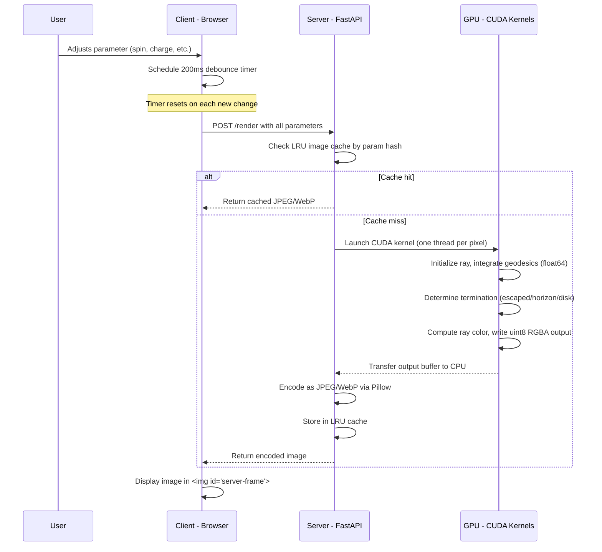
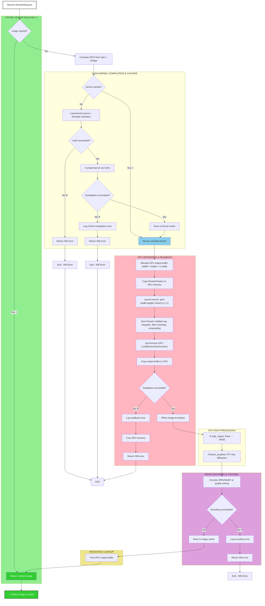

# Nulltracer — GPU-Accelerated Curved Spacetime Rendering Architecture

## 1. Overview

This document describes the CUDA-only rendering architecture for Nulltracer. The system consists of a lightweight browser client that displays server-rendered frames from a GPU-accelerated backend. All rendering is performed server-side using CUDA compute kernels; there is no local client-side rendering.

### Design Principles

- **Server-only rendering** — All black hole ray tracing and image synthesis occurs on the server via CUDA kernels
- **Thin client** — The browser provides parameter controls (sliders/buttons) and displays the server image in a fixed viewport
- **Stateless API** — Each render request is self-contained; the server caches results by parameter hash
- **High precision** — float64 for geodesic integration and metric evaluation; float32 for color; uint8 for final output

### Rendering Pipeline Overview



---

## 2. Server Architecture

### 2.1 Directory Structure

```
nulltracer/server/
├── app.py                 # FastAPI application entry point (/render, /ray, /health, /scenes endpoints)
├── renderer.py            # CudaRenderer: kernel compilation, execution, GPU management
├── cache.py               # LRU image cache by parameter hash
├── isco.py                # ISCO calculation (port of iscoJS/iscoKN)
├── bloom.py               # Airy disk bloom post-processing (FFT convolution, sRGB-linear-sRGB)
├── scenes.py              # Scene file management (SceneManager, JSON persistence, bundled defaults)
├── Dockerfile             # nvidia/cuda:12.2.0-devel-ubuntu22.04 base
├── requirements.txt       # fastapi, uvicorn, cupy-cuda12x, Pillow, numpy, scipy
├── __init__.py
├── scenes/                # Built-in scene JSON files (read-only)
│   ├── default.json           # Default scene (Kerr spin=0.6)
│   ├── schwarzschild.json     # Non-spinning black hole (a=0)
│   ├── extreme-kerr.json      # Near-maximal spin (a=0.998)
│   ├── face-on.json           # Face-on inclination (θ=12°)
│   └── charged-black-hole.json # Reissner-Nordström (charge parameter)
└── kernels/
    ├── geodesic_base.cu    # Shared metric functions, geodesic RHS, constants, sRGB conversion, compositing (float64)
    ├── backgrounds.cu      # Background rendering (stars, checker, colormap)
    ├── disk.cu             # Accretion disk emission and color computation
    ├── ray_trace.cu        # Single-ray tracing kernel for /ray endpoint
    └── integrators/
        ├── rk4.cu          # RK4 4th-order Runge-Kutta integrator kernel
        ├── rkdp8.cu          # Dormand-Prince adaptive 8th-order RK kernel
        ├── tao_yoshida4.cu   # Tao + Yoshida 4th-order symplectic (extended phase space)
        ├── tao_yoshida6.cu   # Tao + Yoshida 6th-order symplectic (extended phase space)
        └── tao_kahan_li8.cu  # Tao + Kahan-Li 8th-order symplectic (extended phase space)
```

### 2.2 FastAPI Application ([`app.py`](server/app.py))

The main entry point providing a REST API for render requests:

```python
# Pseudocode structure
from fastapi import FastAPI
from fastapi.middleware.cors import CORSMiddleware

app = FastAPI(title="Nulltracer Render Server")

app.add_middleware(
    CORSMiddleware,
    allow_origins=["*"],
    allow_methods=["POST", "GET"],
    allow_headers=["*"],
)

@app.on_event("startup")
async def startup_event():
    """Initialize CUDA renderer on server startup."""
    renderer.initialize()

@app.get("/health")
async def health():
    return {"status": "ok", "gpu": renderer.gpu_info, "backends": ["cuda"]}

@app.post("/render")
async def render(params: RenderRequest) -> Response:
    # 1. Compute cache key from params
    # 2. Check LRU cache
    # 3. On miss: acquire GPU lock, render via CUDA, encode, cache
    # 4. Return image bytes with appropriate Content-Type header
    ...
```

**Startup**: On application startup (`@app.on_event("startup")`), initialize the CUDA context and compile the default kernel (Yoshida 4th order). This context persists for the lifetime of the process.

**Shutdown**: On shutdown, release CUDA device memory and destroy contexts.

### 2.3 CUDA Renderer ([`renderer.py`](server/renderer.py))

The `CudaRenderer` class manages CUDA kernel compilation, caching, and execution:

```python
class CudaRenderer:
    """CUDA-based renderer using CuPy RawKernel."""

    def __init__(self):
        self._kernel_cache: dict[str, cp.RawKernel] = {}
        self._gpu_info: str = "unknown"
        self._initialized = False

    def initialize(self) -> None:
        """Initialize CUDA context and query GPU properties."""
        # Force CUDA context creation on device 0
        cp.cuda.Device(0).use()
        
        # Query GPU info: name, memory, compute capability
        props = cp.cuda.runtime.getDeviceProperties(0)
        self._gpu_info = f"{name} ({mem_gb:.1f} GB, compute {cc})"
        
        # Pre-compile the default kernel
        self._get_kernel("rkdp8")

    def render_frame(self, params: dict) -> bytes:
        """Render a frame via CUDA.
        
        Returns raw RGB bytes (uint8, no padding).
        """
        # 1. Resolve kernel source (inline #include directives)
        # 2. Get or compile CuPy RawKernel for the integration method
        # 3. Prepare GPU memory: input RenderParams, output RGBA buffer
        # 4. Launch kernel: (width, height) blocks × 1 thread per pixel
        # 5. Transfer output buffer back to CPU
        # 6. Return as numpy array
        ...
```

#### Kernel Compilation

Each integration method (`rk4`, `rkdp8`, `kahanli8s`, `kahanli8s_ks`, `tao_yoshida4`, `tao_yoshida6`, `tao_kahan_li8`) has a corresponding CUDA kernel in `server/kernels/integrators/*.cu`. The `CudaRenderer` maintains a kernel cache keyed by method name, avoiding recompilation:

```python
_kernel_cache: dict[str, cp.RawKernel] = {}

def _get_kernel(self, method: str) -> cp.RawKernel:
    if method not in self._kernel_cache:
        source, entry_point = self._load_kernel_source(method)
        kernel = cp.RawKernel(source, entry_point)
        self._kernel_cache[method] = kernel
    return self._kernel_cache[method]
```

#### GPU Memory Management

For each render request:

```
1. Create a ctypes-compatible RenderParams structure with all parameters
   (width, height, spin, charge, inclination, FOV, etc.)
2. Allocate GPU output buffer: (width * height * 3) uint8 bytes for RGB
3. Copy RenderParams to GPU constant memory or global memory
4. Launch kernel with grid = (width, height), block = (1, 1, 1)
   - Each thread processes one pixel, writes to output buffer
5. Synchronize with GPU (cudaDeviceSynchronize via CuPy)
6. Copy output buffer back to CPU
7. Return numpy array of shape (height, width, 3) with dtype uint8
```

### 2.4 ISCO Calculation ([`isco.py`](server/isco.py))

A direct port of the JavaScript [`iscoJS()`](index.html:942) and [`iscoKN()`](index.html:861) functions, computing the Innermost Stable Circular Orbit radius for a given black hole spin and charge.

**Logic**:
1. If `Q == 0`: use the analytic Kerr formula
2. If `Q != 0`: use numerical bisection on the effective potential

The ISCO value is computed server-side and passed as a parameter to the CUDA kernel. This ensures the client and server agree on the ISCO radius.

### 2.5 LRU Image Cache ([`cache.py`](server/cache.py))

Cache rendered images to avoid redundant GPU work for identical parameter sets.

**Cache key**: SHA-256 hash of the canonical JSON representation of all render parameters (sorted keys):

```python
def cache_key(params: dict) -> str:
    canonical = json.dumps(params, sort_keys=True, separators=(",", ":"))
    return hashlib.sha256(canonical.encode()).hexdigest()[:16]
```

**Cache implementation**: Custom LRU dict with:
- **Max entries**: 512 (configurable via `CACHE_MAX_ENTRIES` env var)
- **Max memory**: 256 MB (configurable via `CACHE_MAX_BYTES` env var)
- **Eviction**: LRU by access time; also evict if total memory exceeds limit

**Cache bypass**: Possible future enhancement via `Cache-Control: no-cache` header.

### 2.6 Concurrency Model

The server runs a **single CUDA context** shared across all requests. CUDA operations are not thread-safe, so:

1. **Single-worker uvicorn** with `--workers 1` (GPU context is per-process)
2. **asyncio.Lock** guards all CUDA calls — only one render executes at a time
3. Requests queue behind the lock; FastAPI's async handler yields while waiting
4. CPU-bound work (image encoding) runs in a thread pool via `asyncio.to_thread()`

```python
gpu_lock = asyncio.Lock()

async def render_frame(params: dict) -> bytes:
    async with gpu_lock:
        return await asyncio.to_thread(_render_sync, params)
```

**Scaling**: For higher throughput, run multiple single-worker containers behind a load balancer, each with its own GPU or sharing via NVIDIA MPS.

### 2.7 Docker Containerization

```dockerfile
FROM nvidia/cuda:12.2.0-devel-ubuntu22.04

RUN apt-get update && apt-get install -y \
    python3 python3-pip \
    && rm -rf /var/lib/apt/lists/*

WORKDIR /app
COPY requirements.txt .
RUN pip3 install --no-cache-dir -r requirements.txt

COPY . .

EXPOSE 8000
CMD ["uvicorn", "app:app", "--host", "0.0.0.0", "--port", "8000", "--workers", "1"]
```

**GPU passthrough**: Run with `--gpus all` (Docker) or `--device nvidia.com/gpu=all` (containerd):

```bash
docker run --gpus all -p 8000:8000 nulltracer-server
```

**Dependencies** ([`requirements.txt`](server/requirements.txt)):

```
fastapi>=0.104
uvicorn[standard]>=0.24
cupy-cuda12x>=13.0
Pillow>=10.0
numpy>=1.24
pydantic>=2.0
```

### 2.8 Server Module Dependency Graph

```
app.py (FastAPI entry point)
├── renderer.py          → Manages CUDA kernel compilation and execution
│   ├── isco.py         → ISCO calculation (called during render)
│   └── kernels/
│       ├── geodesic_base.cu     → Shared metric functions, RHS
│       ├── backgrounds.cu       → Background rendering
│       ├── disk.cu              → Disk color computation
│       └── integrators/*.cu     → Integrator-specific kernels
├── cache.py             → LRU image cache
└── models.py            → Pydantic request validation (RenderRequest)
```

**Module responsibilities:**
- **`app.py`** — FastAPI entry point, request routing, response formatting
- **`renderer.py`** — CUDA kernel compilation, GPU memory management, kernel execution
- **`isco.py`** — ISCO radius calculation from spin and charge
- **`cache.py`** — LRU image caching by parameter hash
- **`kernels/`** — CUDA compute kernels for ray tracing (all computation happens here)

---

## 3. CUDA Kernel Architecture

### 3.1 Kernel Organization

The CUDA rendering pipeline is split into modular kernel files:

| File | Purpose |
|------|---------|
| [`geodesic_base.cu`](server/kernels/geodesic_base.cu) | Metric functions, geodesic RHS, constants, shared utilities (float64) |
| [`backgrounds.cu`](server/kernels/backgrounds.cu) | Procedural background: stars, checker pattern, colormap |
| [`disk.cu`](server/kernels/disk.cu) | Accretion disk emission, blackbody color, redshift |
| [`integrators/rk4.cu`](server/kernels/integrators/rk4.cu) | RK4 4th-order Runge-Kutta integrator kernel |
| [`integrators/rkdp8.cu`](server/kernels/integrators/rkdp8.cu) | Dormand-Prince adaptive 8th-order integrator kernel |
| [`integrators/tao_yoshida4.cu`](server/kernels/integrators/tao_yoshida4.cu) | Tao + Yoshida 4th-order symplectic (extended phase space) |
| [`integrators/tao_yoshida6.cu`](server/kernels/integrators/tao_yoshida6.cu) | Tao + Yoshida 6th-order symplectic (extended phase space) |
| [`integrators/tao_kahan_li8.cu`](server/kernels/integrators/tao_kahan_li8.cu) | Tao + Kahan-Li 8th-order symplectic (extended phase space) |
| [`integrators/kahanli8s.cu`](server/kernels/integrators/kahanli8s.cu) | Kahan-Li 8th-order symplectic integrator kernel with Sundman time transformation |

### 3.2 RenderParams Structure

All rendering parameters are passed to the kernel via a single C-compatible struct:

```c
struct RenderParams {
    double width, height;           // Output resolution
    double spin, charge;            // Black hole spin and charge
    double incl;                    // Observer inclination (radians)
    double fov;                     // Field of view
    double phi0;                    // Disk rotation (typically 0)
    double isco;                    // Innermost stable circular orbit
    double steps;                   // Integration step count
    double obs_dist;                // Observer distance in M
    double esc_radius;              // Escape radius (obs_dist + 12)
    double disk_outer;              // Outer disk radius (14.0)
    double step_size;               // Base step size (H_BASE)
    double bg_mode;                 // Background: 0=stars, 1=checker, 2=colormap
    double star_layers;             // Number of background star layers
    double show_disk;               // Show disk: 1.0 or 0.0
    double show_grid;               // Show grid: 1.0 or 0.0
    double disk_temp;               // Disk temperature multiplier
    double srgb_output;             // Apply sRGB OETF: 1.0 or 0.0 (default: 1.0)
    double disk_alpha;              // Base opacity per disk crossing (0.0-1.0, default: 1.0)
    double disk_max_crossings;      // Maximum disk crossings per ray (1-20, default: 1)
    double bloom_enabled;           // Enable Airy disk bloom: 1.0 or 0.0 (default: 0.0)
};
```

**Note**: All fields are `double` (float64) for alignment consistency between Python ctypes and CUDA. Integer values are stored as doubles and cast within the kernel.

**New fields** (post-processing and compositing):
- `srgb_output` — When > 0.5, applies the IEC 61966-2-1 sRGB transfer function (gamma encoding) to linear RGB before output
- `disk_alpha` — Controls the base opacity (alpha) of each disk crossing. Value in [0.0, 1.0]; used in front-to-back alpha blending
- `disk_max_crossings` — Limits the number of times a ray can cross the disk. When set to 1 (default), only the first crossing contributes color (backward compatible); higher values enable multi-crossing compositing
- `bloom_enabled` — When > 0.5, post-processing applies Airy disk bloom convolution (CPU-side after CUDA render)

### 3.3 Kernel Execution Model

Each CUDA kernel is launched as:

```cuda
// Launch: one thread per pixel
kernel<<<dim3(width, height), dim3(1, 1, 1)>>>(params, output_buffer);

__global__ void trace_yoshida4(RenderParams params, uint8_t *output_buffer) {
    int x = blockIdx.x;
    int y = blockIdx.y;
    int pixel_idx = (y * (int)params.width + x) * 3;  // RGB triple
    
    // 1. Initialize ray from observer position
    // 2. Run Yoshida 4th-order integration loop
    // 3. Determine termination condition (escaped/horizon/disk)
    // 4. Compute ray color
    // 5. Write uint8 RGBA to output_buffer[pixel_idx:pixel_idx+3]
}
```

### 3.4 Numerical Precision

- **Integration**: float64 (double) for all geodesic computations
  - Metric evaluation: `g_μν`
  - Geodesic RHS: `dp/dλ`, `dx/dλ`
  - All intermediate calculations maintain full precision
- **Color computation**: float32 allowed for efficiency (RGB color is inherently low-precision)
- **Output**: uint8 (0-255) per channel for final RGBA

### 3.5 Key Technical Decisions

#### Why CUDA Instead of OpenGL

- **Compute kernels** allow per-pixel parallel execution without graphics pipeline overhead
- **Direct memory access** for ray state and output buffers
- **float64 support** is native and efficient; OpenGL requires extensions or workarounds
- **Kernel caching** avoids recompilation when parameters don't change
- **No graphics context** complexity; CUDA context is simpler to initialize in Docker

#### Why One Thread Per Pixel

- **Simplicity** — Each thread manages one ray independently; minimal inter-thread communication
- **Scalability** — Fully independent workload, embarrassingly parallel
- **Memory efficiency** — Each thread's local state (ray position, velocity, etc.) fits in registers
- **Register pressure** — Modern GPUs have enough registers per thread for full ray state (typically ~30 registers per thread)

### 3.6 kahanli8s: Kahan-Li 8th-Order Symplectic Integrator

The **kahanli8s** integrator (`trace_kahanli8s` in [`kahanli8s.cu`](server/kernels/integrators/kahanli8s.cu)) is a high-accuracy geometric integrator designed for near-horizon black hole ray tracing. It combines multiple numerical techniques to achieve ~10th-order effective accuracy while maintaining symplecticity.

#### Architecture Overview

**kahanli8s** comprises five integrated components:

1. **Kahan-Li s15odr8 composition** — A 15-stage symmetric composition of the leapfrog integrator using optimized coefficients from Kahan & Li (1997). The composition is palindromic (coefficients are symmetric), with maximum weight magnitude |W_i| = 0.797, ensuring all substep displacements remain bounded by the step size.

2. **Sundman/Mino time transformation** — Instead of adaptive step-size selection (which breaks symplecticity; Ge & Marsden 1988), a coordinate time transformation dτ = dλ/Σ is used, where Σ = r² + a²cos²θ. This provides automatic step adaptation (small steps near the horizon where spacetime curvature is extreme, large steps at large radii) while preserving the symplectic structure. The Mino-time budget is computed from the exact Bardeen photon sphere radius, allowing accurate allocation of integration steps.

3. **Compensated (Kahan) summation** — All accumulations of state variables use Kahan summation with a correction term, tracking floating-point round-off error and effectively doubling working precision. This preserves the modified Hamiltonian (the discrete Hamiltonian function of the integrator) to machine precision, crucial for long integration paths.

4. **Symplectic corrector** — A near-identity canonical transformation (h²/24 correction term) applied after each step, raising the effective accuracy from 8th to approximately 10th order at the cost of one additional geodesic RHS evaluation per step (31 RHS calls total per full step: 15 composition stages × 2 half-steps + 1 corrector).

5. **Hamiltonian projection** — After each step, the momenta are algebraically solved onto the H=0 null geodesic constraint by adjusting p_r, ensuring rays remain on the light cone. This is performed exactly (not iteratively), preventing energy drift on long integration paths.

#### Computation Cost

```
Per full integration step:
  • 15 composition stages
  • 2 RHS evaluations per stage (half-step kicks)
  = 30 RHS calls from composition
  + 1 RHS call for symplectic corrector
  ────────────────────────────
  = 31 RHS evaluations per step
```

With default settings (200 steps, 320×180 pixels):
- **RTX 3090 performance**: ~0.6–1.7 seconds per frame
- **Compared to rk4**: ~3–8× slower, but with dramatically superior accuracy at extreme inclinations (θ > 85°) and near the event horizon

#### Diagnostic Capability

The integrator computes the **Carter constant** Q₀ at initialization based on impact parameters. This value can be used for post-render validation to confirm geodesic conserved quantities are maintained.

#### Mathematical References

- **Kahan & Li (1997)**: "Composition constants for raising the orders of unconventional schemes for ordinary differential equations." *Math. Comp.* 66(219):1089–1099.
- **Wisdom (2006)**: "Symplectic correctors for canonical heliocentric N-body maps." *Astron. J.* 131:2294–2298.
- **Kahan (1965)**: "Pracniques: further remarks on reducing truncation errors." *Comm. ACM* 8(1):40.
- **Ge & Marsden (1988)**: "Lie-Poisson Hamilton-Jacobi theory and Lie-Poisson integrators." *Phys. Lett. A* 133(3):134–139.
- **Mino (2003)**: "Perturbative approach to an orbital evolution around a supermassive black hole." *Phys. Rev. D* 67:084027.

#### When to Use kahanli8s

- **High-inclination scenarios** (θ > 80°): Visible accuracy improvement over lower-order integrators
- **Near-horizon detail**: Rendering structures very close to r_+ requires the step adaptation of Sundman time
- **Publication-quality output**: The ~10th-order accuracy and symplecticity are suitable for scientific visualization
- **Disk inner edge dynamics**: Precise ray-disk intersection detection near the ISCO

Not recommended for:
- **Real-time interaction** at high resolution; use **rk4** for responsive preview
- **Low-inclination views** where geodesics are nearly radial; lower-order integrators converge adequately

---

## 4. API Contract

### 4.1 `POST /render`

**Request body** (`application/json`):

```json
{
  "spin": 0.6,
  "charge": 0.0,
  "inclination": 80.0,
  "fov": 8.0,
  "width": 1920,
  "height": 1080,
  "method": "rkdp8",
  "steps": 200,
  "step_size": 0.3,
  "obs_dist": 40,
  "bg_mode": 1,
  "show_disk": true,
  "show_grid": true,
  "disk_temp": 1.0,
  "star_layers": 3,
  "phi0": 0.0,
  "srgb_output": true,
  "disk_alpha": 1.0,
  "disk_max_crossings": 1,
  "bloom_enabled": false,
  "bloom_radius": 1.0,
  "format": "jpeg",
  "quality": 85
}
```

**Pydantic model** ([`app.py`](server/app.py:30)):

```python
class RenderRequest(BaseModel):
    spin: float = Field(0.6, ge=0, le=0.998)
    charge: float = Field(0.0, ge=0, le=0.998)
    inclination: float = Field(80.0, ge=3, le=89)
    fov: float = Field(8.0, ge=2, le=25)
    width: int = Field(1280, ge=160, le=3840)
    height: int = Field(720, ge=90, le=2160)
    method: str = Field("rkdp8", pattern=r"^(rk4|rkdp8|kahanli8s|kahanli8s_ks|tao_yoshida4|tao_yoshida6|tao_kahan_li8)$")
    steps: int = Field(200, ge=60, le=500)
    step_size: float = Field(0.3, ge=0.1, le=0.8)
    obs_dist: int = Field(40, ge=20, le=100)
    bg_mode: int = Field(1, ge=0, le=2)
    show_disk: bool = Field(True)
    show_grid: bool = Field(True)
    disk_temp: float = Field(1.0, ge=0.2, le=2.5)
    star_layers: int = Field(3, ge=1, le=4)
    phi0: float = Field(0.0)
    srgb_output: bool = Field(True)
    disk_alpha: float = Field(1.0, ge=0.0, le=1.0)
    disk_max_crossings: int = Field(1, ge=1, le=20)
    bloom_enabled: bool = Field(False)
    bloom_radius: float = Field(1.0, ge=0.1, le=5.0)
    format: str = Field("jpeg", pattern=r"^(jpeg|webp)$")
    quality: int = Field(85, ge=10, le=100)

    @model_validator(mode="after")
    def check_spin_charge_constraint(self):
        if self.spin ** 2 + self.charge ** 2 > 1.0:
            raise ValueError("spin² + charge² must be ≤ 1")
        return self
```

**Validation rules**:
- `0 ≤ spin ≤ 0.998`
- `0 ≤ charge ≤ 0.998`
- `spin² + charge² ≤ 1.0` (naked singularity constraint, enforced via validator)
- `160 ≤ width ≤ 3840`
- `90 ≤ height ≤ 2160`
- Total pixel count `width * height ≤ 8,294,400` (4K cap)

**Response** (success — `200 OK`):

```
Content-Type: image/jpeg | image/webp
Content-Length: <bytes>
X-Render-Time-Ms: 142
X-Cache: HIT | MISS
X-Backend: cuda

<binary image data>
```

**Response** (validation error — `422 Unprocessable Entity`):

```json
{
  "detail": [
    {
      "loc": ["body", "spin"],
      "msg": "ensure this value is less than or equal to 0.998",
      "type": "value_error.number.not_le"
    }
  ]
}
```

**Response** (CUDA error — `500 Internal Server Error`):

```json
{
  "error": "cuda_render_failed",
  "detail": "CUDA kernel execution failed: ..."
}
```

**Response** (GPU unavailable — `503 Service Unavailable`):

```json
{
  "error": "gpu_unavailable",
  "detail": "CUDA renderer not initialized"
}
```

### 4.2 `GET /health`

**Response** (`200 OK`):

```json
{
  "status": "ok",
  "gpu": "NVIDIA GeForce RTX 3090 (24.0 GB, compute 8.6)",
  "backends": ["cuda"]
}
```

### 4.3 `POST /ray`

General-purpose single-ray tracing endpoint. Traces one photon geodesic through Kerr-Newman spacetime and returns the full trajectory, equatorial plane crossings with disk physics, and termination conditions.

**Request body** (`application/json`):

```json
{
  "mode": "pixel",
  "ix": 160,
  "iy": 90,
  "spin": 0.6,
  "charge": 0.0,
  "inclination": 80.0,
  "method": "rkdp8",
  "fov": 8.0,
  "width": 320,
  "height": 180,
  "steps": 200,
  "step_size": 0.3,
  "obs_dist": 40,
  "phi0": 0.0,
  "doppler_boost": 2,
  "disk_temp": 1.0,
  "include_trajectory": true,
  "include_disk_physics": true,
  "max_trajectory_points": 200
}
```

**Input modes**:
- `"pixel"` — specify screen coordinates `(ix, iy)` to trace (defaults to image center)
- `"impact_parameter"` — specify `(alpha, beta)` angles directly in radians

**Impact parameter mode example**:

```json
{
  "mode": "impact_parameter",
  "alpha": -0.05,
  "beta": 0.02,
  "spin": 0.998,
  "inclination": 85.0,
  "method": "rk4"
}
```

**Pydantic model** ([`app.py`](server/app.py:444)):

```python
class RayRequest(BaseModel):
    mode: str = Field("pixel", pattern=r"^(pixel|impact_parameter)$")
    ix: Optional[int] = Field(None, ge=0)
    iy: Optional[int] = Field(None, ge=0)
    alpha: Optional[float] = None
    beta: Optional[float] = None
    spin: float = Field(0.6, ge=0, le=0.998)
    charge: float = Field(0.0, ge=0, le=0.998)
    inclination: float = Field(80.0, ge=3, le=89)
    method: str = Field("rkdp8", pattern=r"^(rk4|rkdp8|...)$")
    fov: float = Field(8.0, ge=2, le=25)
    width: int = Field(320, ge=16, le=3840)
    height: int = Field(180, ge=16, le=2160)
    steps: int = Field(200, ge=60, le=500)
    step_size: float = Field(0.3, ge=0.1, le=0.8)
    obs_dist: int = Field(40, ge=20, le=100)
    phi0: float = Field(0.0)
    doppler_boost: int = Field(2, ge=0, le=2)
    disk_temp: float = Field(1.0, ge=0.2, le=2.5)
    include_trajectory: bool = Field(True)
    include_disk_physics: bool = Field(True)
    max_trajectory_points: int = Field(200, ge=10, le=500)
```

**Response** (success — `200 OK`, `application/json`):

```json
{
  "ray": {
    "mode": "pixel",
    "ix": 160,
    "iy": 90,
    "b": -1.234
  },
  "spacetime": {
    "spin": 0.6,
    "charge": 0.0,
    "r_plus": 1.8,
    "r_isco": 3.829,
    "method": "rkdp8",
    "effective_method": "rkdp8"
  },
  "initial_state": {
    "r": 40.0, "theta": 1.396, "phi": 0.0,
    "pr": -0.998, "pth": -0.456
  },
  "final_state": {
    "r": 52.0, "theta": 0.87, "phi": 3.14,
    "pr": 0.12, "pth": -0.03
  },
  "termination": {
    "reason": "escape",
    "steps_used": 147,
    "steps_max": 200
  },
  "trajectory": {
    "points": 147,
    "r": [40.0, 39.7, "..."],
    "theta": [1.396, 1.395, "..."],
    "phi": [0.0, 0.001, "..."],
    "step_sizes": [0.3, 0.29, "..."]
  },
  "disk_crossings": [
    {
      "crossing_index": 42,
      "r": 6.12,
      "phi": 1.23,
      "direction": "north_to_south",
      "g_factor": 1.15,
      "novikov_thorne_flux": 0.73,
      "T_emit": 6400.0,
      "T_observed": 7360.0
    }
  ],
  "timing": {
    "kernel_ms": 0.12,
    "total_ms": 1.45
  }
}
```

**Termination reasons**:
- `"escape"` — ray reached escape radius (background)
- `"horizon"` — ray captured by event horizon
- `"steps_exhausted"` — maximum integration steps reached
- `"nan"` — numerical instability detected
- `"underflow"` — radius dropped below safety threshold

**Integrator support**: The ray trace kernel natively supports all available methods (`rk4`, `rkdp8`, `kahanli8s`, `kahanli8s_ks`, `tao_yoshida4`, `tao_yoshida6`, `tao_kahan_li8`). The `effective_method` field in the response indicates which integrator was actually used.

**Disk crossing physics**: Each equatorial plane crossing includes:
- `g_factor` — gravitational redshift factor ν_obs/ν_emit
- `novikov_thorne_flux` — normalized Page-Thorne radial flux F/F_max
- `T_emit` — emitted blackbody temperature (K)
- `T_observed` — observed temperature after redshift (K)

### 4.4 Scene Management Endpoints

Scene files are stored as JSON in `server/scenes/` and managed via REST endpoints.

#### `GET /scenes`

List all available scenes (built-in and user-saved).

**Response** (success — `200 OK`, `application/json`):

```json
{
  "scenes": [
    {
      "name": "default",
      "builtin": true,
      "params": {
        "spin": 0.6,
        "charge": 0.0,
        "inclination": 80.0,
        ...
      }
    },
    {
      "name": "my-custom-scene",
      "builtin": false,
      "params": { ... }
    }
  ]
}
```

#### `GET /scenes/{name}`

Retrieve a specific scene by name.

**Parameters**:
- `name` (path) — Scene name (alphanumeric, hyphens, underscores, spaces; 1-63 chars)

**Response** (success — `200 OK`, `application/json`):

```json
{
  "name": "default",
  "builtin": true,
  "params": {
    "spin": 0.6,
    "charge": 0.0,
    "inclination": 80.0,
    "fov": 8.0,
    ...
  }
}
```

**Response** (not found — `404 Not Found`):

```json
{
  "error": "scene_not_found",
  "detail": "Scene 'unknown' not found"
}
```

#### `POST /scenes/{name}`

Save or update a scene. Built-in scenes cannot be modified.

**Request body** (`application/json`):

```json
{
  "params": {
    "spin": 0.7,
    "charge": 0.0,
    "inclination": 75.0,
    "fov": 8.5,
    ...
  }
}
```

**Validation**:
- Scene name must pass alphanumeric + hyphens/underscores/spaces (1-63 chars) validation
- Built-in scenes (marked `_builtin: true` in JSON) cannot be overwritten
- Parameter whitelist (`VALID_PARAMS`) ensures only rendering parameters are stored

**Response** (success — `201 Created` or `200 OK`):

```json
{
  "name": "my-custom-scene",
  "builtin": false,
  "params": { ... }
}
```

**Response** (forbidden — `403 Forbidden`):

```json
{
  "error": "builtin_scene_protected",
  "detail": "Cannot modify built-in scene 'default'"
}
```

#### `DELETE /scenes/{name}`

Delete a user-saved scene. Built-in scenes cannot be deleted.

**Response** (success — `204 No Content`):

```
(empty body)
```

**Response** (forbidden — `403 Forbidden`):

```json
{
  "error": "builtin_scene_protected",
  "detail": "Cannot delete built-in scene 'default'"
}
```

### 4.5 CORS Configuration

The server enables CORS for all origins by default (configurable):

```python
app.add_middleware(
    CORSMiddleware,
    allow_origins=["*"],
    allow_methods=["GET", "POST", "DELETE"],
    allow_headers=["Content-Type"],
    expose_headers=["X-Render-Time-Ms", "X-Cache", "X-Backend"],
)
```

---

## 5. Client Architecture

### 5.1 Frontend File Structure

```
nulltracer/
├── index.html              # HTML markup + title/legend + parameter controls
├── styles.css              # All CSS for layout, panels, controls
└── js/
    ├── main.js             # ES6 module entry point, shared state, initialization
    ├── server-client.js    # Server render requests, debouncing, health checks
    └── ui-controller.js    # DOM event handlers, slider logic, presets
```

### 5.2 Client Architecture (ES6 Modular)

The client is a thin server-only viewer with modular JavaScript:

| File | Purpose |
|------|---------|
| [`index.html`](index.html) | HTML markup, `` viewport, parameter controls, panels |
| [`styles.css`](styles.css) | CSS layout, responsive design, panel styling |
| [`js/main.js`](js/main.js) | ES6 entry point, shared state, module initialization |
| [`js/server-client.js`](js/server-client.js) | Server render fetch, debouncing, auto-detection, health checks |
| [`js/ui-controller.js`](js/ui-controller.js) | DOM event handlers, slider/button logic, presets, scene management |

### 5.3 Rendering Flow

```
1. User adjusts parameter (slider/button) or loads scene
   ↓
2. DOM event handler updates state, calls scheduleServerRender()
   ↓
3. Debounce timer starts (200ms)
   ↓
4. If user changes another parameter within 200ms, timer resets
   ↓
5. When timer fires (200ms idle), construct JSON params
   ↓
6. POST /render to server URL
   ↓
7. Server checks cache, on miss renders via CUDA
   ↓
8. Server applies post-processing (sRGB, bloom) if enabled
   ↓
9. Server returns JPEG/WebP image
   ↓
10. Client displays in 
```

### 5.4 Server Auto-Detection

On page load, the client attempts to detect a same-origin server:

```javascript
export async function autoDetectServer() {
    // Check if server is at default origin (same origin, port 8000)
    const url = window.location.origin + ':8000';
    const ok = await checkServerHealth();
    if (ok) {
        setServerUrl(url);
        scheduleServerRender();  // Begin rendering
    } else {
        // Show error message, wait for manual server URL entry
    }
}
```

### 5.5 Shared Application State

All modules reference a shared state object for parameter values:

```javascript
const state = {
    spin: 0,
    charge: 0,
    incl: 89,
    diskTemp: 1,
    showDisk: 1,
    showGrid: 1,
    autoRotate: false,
    rotAngle: 0,
    fov: 8,
    bgMode: 1,
    qMethod: 'rkdp8',
    qSteps: 200,
    qResScale: 1.0,
    qStepSize: 0.3,
    qObsDist: 40,
    qStarLayers: 3,
    srgbOutput: true,
    diskAlpha: 1.0,
    diskMaxCrossings: 1,
    bloomEnabled: false,
    bloomRadius: 1.0,
    currentScene: 'default',
    renderMode: 'server',
};
```

This is passed to all modules so they can read/write shared parameters and coordinate.

**New parameters** (post-processing and advanced features):
- `srgbOutput` — Enable sRGB gamma encoding on output (default: true)
- `diskAlpha` — Base opacity per disk crossing; controls how opaque each disk intersection appears (default: 1.0, range 0.0-1.0)
- `diskMaxCrossings` — Maximum number of disk crossings per ray (default: 1, range 1-20; backward compatible)
- `bloomEnabled` — Enable Airy disk bloom post-processing (default: false)
- `bloomRadius` — Bloom kernel radius multiplier (default: 1.0, range 0.1-5.0)
- `currentScene` — Currently loaded scene name (default: 'default')

### 5.6 Spin/Charge Constraint Enforcement

The UI enforces the Kerr-Newman naked singularity constraint: `spin² + charge² ≤ 1.0`

When one parameter changes, the other is clamped if necessary:

```javascript
document.getElementById('spin').addEventListener('input', function(){
    stateRef.spin = +this.value;
    // Enforce: spin² + charge² <= 1
    const maxQ = Math.sqrt(Math.max(1 - stateRef.spin*stateRef.spin, 0));
    if (stateRef.charge > maxQ) {
        stateRef.charge = Math.floor(maxQ * 500) / 500;
        document.getElementById('charge').value = stateRef.charge;
    }
    scheduleServerRender();
});
```

### 5.7 Quality Presets

Presets adjust integration method, steps, and observer distance for performance/quality trade-off:

```javascript
const presets = {
    low:    {method:'rk4',      steps:80,  stepSize:0.5,  obsDist:30, starLayers:1},
    medium: {method:'rkdp8',    steps:200, stepSize:0.3,  obsDist:40, starLayers:3},
    high:   {method:'rkdp8',    steps:180, stepSize:0.40, obsDist:50, starLayers:4},
    ultra:  {method:'rkdp8',    steps:200, stepSize:0.45, obsDist:60, starLayers:4},
    extreme:{method:'kahanli8s', steps:180, stepSize:0.35, obsDist:70, starLayers:4},
};
```

Presets are applied via buttons in the settings panel, updating sliders and state:
- **low** — Fast preview (rk4, 80 steps) for rapid exploration
- **medium** — Default balance (rkdp8, 200 steps)
- **high** — Enhanced accuracy (rkdp8, 180 steps)
- **ultra** — Maximum accuracy (rkdp8, 200 steps) with excellent convergence
- **extreme** — Maximum accuracy (kahanli8s, 180 steps) for publication-quality output at extreme inclinations

### 5.8 Client UI Controls for New Features

The client interface includes new controls for post-processing and advanced rendering:

- **sRGB Output toggle** — Enable/disable sRGB color output (default: enabled)
  - When enabled, applies IEC 61966-2-1 OETF to convert linear RGB → sRGB for standard display calibration
- **Disk Opacity slider** — Control base opacity per disk crossing (0.0-1.0, default: 1.0)
  - Used in alpha-blended compositing for semi-transparent disk effects
- **Max Crossings slider** — Maximum disk crossings per ray (1-20, default: 1)
  - Default value of 1 preserves backward compatibility (first hit wins)
  - Higher values enable multi-crossing alpha compositing
- **Bloom toggle** — Enable/disable Airy disk bloom post-processing (default: disabled)
- **Bloom Radius slider** — Bloom kernel radius multiplier (0.1-5.0, default: 1.0)
  - Controls the size of the Airy diffraction halo
- **Scene dropdown and buttons** — Load saved scenes, save current parameters as scene, or delete custom scenes
  - Built-in scenes (default, schwarzschild, extreme-kerr, face-on, charged-black-hole) are read-only

---

## 6. Post-Processing Pipeline

Post-processing occurs CPU-side after CUDA rendering is complete. It consists of sRGB color conversion and optional Airy disk bloom diffraction convolution.

### 6.1 sRGB Color Pipeline

sRGB output conversion implements the IEC 61966-2-1 standard piecewise transfer function:

```cuda
// In geodesic_base.cu
__device__ float linear_to_srgb(float c) {
    if (c <= 0.0031308f) {
        return 12.92f * c;
    } else {
        return 1.055f * powf(c, 1.0f / 2.4f) - 0.055f;
    }
}
```

**Applied in `postProcess()`** when `params.srgb_output > 0.5`:

1. Each pixel's linear RGB value is converted individually
2. Clipped to [0, 1] range before conversion
3. Scaled to uint8 [0, 255] for output

**Rationale**:
- Linear RGB is used throughout CUDA rendering for physical accuracy (photons are additive in linear space)
- sRGB encoding is required for correct display on standard monitors
- Default: enabled (True) for proper color perception
- Can be disabled for scientific analysis (linear output)

### 6.2 Airy Disk Bloom Post-Processing

Airy disk bloom simulates diffraction effects from the human eye's pupil aperture. Implemented in [`server/bloom.py`](server/bloom.py):

**Physics**:
- Airy diffraction pattern: `I(r) = (2*J1(r)/r)²` where r is diffraction angle in radians
- Spectral dependence (red diffracts more due to longer wavelength):
  - **Red**: 1.0 (reference)
  - **Green**: 0.86 (shorter wavelength, less diffraction)
  - **Blue**: 0.61 (much less diffraction)
- Diffraction angle from eye physics: `θ = 1.22 × λ / D`
  - λ = 650 nm (mean human eye spectral response)
  - D = 4 mm (typical pupil diameter)
  - Scaled by FOV and image resolution

**Implementation**:
1. **Preprocessing**: Convert sRGB → linear RGB (reverse encoding)
2. **Kernel generation**: Compute Airy disk pattern at per-channel resolution
   - Kernel size adapts based on maximum image brightness (adaptive to prevent noise amplification)
3. **FFT convolution**: Apply bloom via frequency-domain convolution (scipy.ndimage.fft_convolve)
4. **Postprocessing**: Clamp result, convert linear → sRGB

**Parameters**:
- `bloom_enabled: bool` — Enable/disable bloom (default: False)
- `bloom_radius: float` (0.1-5.0, default: 1.0) — Multiplier on diffraction radius
  - 1.0 = physical diffraction from 4mm pupil
  - 0.5 = reduced bloom, sharper image
  - 2.0 = enhanced bloom for artistic effect

**Performance**:
- FFT convolution: O(n log n) where n = width × height
- Typical: 10-50 ms for 1920×1080 (single-threaded CPU)
- **Zero overhead when disabled** — Post-processing is skipped entirely if `bloom_enabled == false`

---

## 7. Scene Management System

Scenes are named collections of rendering parameters stored as JSON files in `server/scenes/`.

### 7.1 Scene Storage and Organization

**Directory structure**:
```
server/scenes/
├── default.json               # Kerr spin=0.6, θ=80° (default view)
├── schwarzschild.json         # Non-spinning (a=0) black hole
├── extreme-kerr.json          # Near-maximal spin (a=0.998)
├── face-on.json               # Face-on inclination (θ=12°)
└── charged-black-hole.json    # Reissner-Nordström (Q≠0)
```

Built-in scenes are marked with `_builtin: true` in JSON and cannot be modified or deleted via API.

### 7.2 Scene File Format

Each scene is a JSON file with:

```json
{
  "_name": "default",
  "_builtin": true,
  "spin": 0.6,
  "charge": 0.0,
  "inclination": 80.0,
  "fov": 8.0,
  "width": 1920,
  "height": 1080,
  "method": "rkdp8",
  "steps": 200,
  "step_size": 0.3,
  "obs_dist": 40,
  "bg_mode": 1,
  "show_disk": true,
  "show_grid": true,
  "disk_temp": 1.0,
  "star_layers": 3,
  "phi0": 0.0,
  "srgb_output": true,
  "disk_alpha": 1.0,
  "disk_max_crossings": 1,
  "bloom_enabled": false,
  "bloom_radius": 1.0
}
```

**Validation**:
- Scene name: alphanumeric + hyphens/underscores/spaces, 1-63 characters
- Parameter whitelist (`VALID_PARAMS`) enforces only rendering parameters can be stored (no arbitrary keys)
- Built-in scenes cannot be overwritten or deleted

### 7.3 Scene Management API

Implemented in [`server/scenes.py`](server/scenes.py) via `SceneManager` class:

| Endpoint | Method | Purpose |
|----------|--------|---------|
| `/scenes` | GET | List all available scenes (built-in + user-saved) |
| `/scenes/{name}` | GET | Retrieve a specific scene's parameters |
| `/scenes/{name}` | POST | Save/update a scene (fails if built-in) |
| `/scenes/{name}` | DELETE | Delete a user-saved scene (fails if built-in) |

### 7.4 Client Scene UI

The client includes scene management controls:

- **Scene dropdown** — List all available scenes; selecting a scene loads its parameters
- **Load Scene button** — Applies scene parameters and triggers a render
- **Save Scene button** — Saves current parameters as a named scene (prompts for scene name)
- **Delete Scene button** — Removes a user-saved scene (disabled for built-in scenes)

Scene loading updates all UI controls (sliders, dropdowns) to match the loaded scene.

---

## 8. Rendering Pipeline Detail

### 8.1 Server-Side CUDA Render Steps



### 8.2 Per-Pixel Ray Tracing

Each CUDA thread traces a single ray from the observer:

```
1. Compute ray direction from pixel coordinates (x, y)
   - Convert to normalized device coords in [-1, 1]
   - Apply FOV and inclination transformation
   - Get ray (α, β) impact parameters in observer frame
2. Initialize ray position at observer: r = obs_dist, θ = π/2, φ = 0
3. Initialize ray direction: (pr, pθ, pφ) from impact parameters
4. Photon loop:
   - Integrate geodesic equations (float64) for N steps
   - Check termination: escaped (r > esc_radius)? horizon? disk hit?
   - If escaped: color = background (stars/checker/colormap)
   - If horizon: color = black
   - If disk: compute disk blackbody color + redshift
   - Break
5. Convert linear RGB to sRGB gamma
6. Convert to uint8 (0-255) per channel
7. Write RGBA to output buffer
```

### 8.3 Integrator Kernels

Each integrator kernel implements the same interface:

```cuda
__global__ void trace_yoshida4(RenderParams params, uint8_t *output_buffer) {
    int x = blockIdx.x;
    int y = blockIdx.y;
    
    // 1. Compute ray direction
    // 2. Initialize ray state (position, velocity)
    // 3. Integration loop (Yoshida 4th-order symplectic)
    //    while (not_terminated && step < params.steps) {
    //        x += h * dx/dlambda
    //        p += h * dp/dlambda
    //    }
    // 4. Terminate & compute color
    // 5. Write to output
}
```

All integrators use the same `geoRHS()` function from [`geodesic_base.cu`](server/kernels/geodesic_base.cu) to compute the geodesic equations in Kerr-Newman spacetime.

### 8.4 Kerr-Newman Metric and Geodesics

The metric is computed in Boyer-Lindquist coordinates with mass M = 1, spin parameter `a`, and charge `Q`. The [`geodesic_base.cu`](server/kernels/geodesic_base.cu) kernel provides:

- **Metric components**: `g_tt`, `g_tφ`, `g_rr`, `g_θθ`, `g_φφ`
- **Christoffel symbols**: Partial derivatives of metric for geodesic equations
- **Geodesic RHS**: `dx^μ/dλ` and `dp_μ/dλ` in first-order Hamiltonian form

All metric computations use float64 for maximum accuracy.

### 8.5 Background Rendering

The [`backgrounds.cu`](server/kernels/backgrounds.cu) kernel provides three background modes:

1. **Stars** (`bg_mode=0`): Procedural Perlin-like noise with multiple layers
2. **Checker** (`bg_mode=1`): Repeating checkerboard pattern in equatorial coordinates
3. **Colormap** (`bg_mode=2`): Gradient-based color map (celestial sphere visualization)

Each is selected at runtime based on `params.bg_mode`.

### 8.6 Accretion Disk Color

The [`disk.cu`](server/kernels/disk.cu) kernel computes disk color when a ray hits the equatorial plane within the disk bounds:

```
1. Check if radius is within disk (ISCO * 0.85 to RDISK)
2. Compute temperature profile: T(r) = T_base * u_temp * (r / r_isco)^(-0.75)
3. Compute bolometric intensity: I ~ T^4 / r
4. Apply GR redshift factor:
   - Compute metric at emission point
   - Compute circular orbit angular velocity
   - Compute redshift: g = 1 / (u^t * (1 - b*Ω))
5. Apply redshift: T_obs = g * T_emit, I_obs = g^4 * I_emit
6. Convert temperature to blackbody color (linear sRGB)
7. Apply turbulence texture (Perlin-like noise)
8. Return final RGB color
```

---

## 9. Performance Characteristics

### 9.1 Bottleneck Analysis

**CUDA kernel time** (per frame, typical):
- Resolution: 1920×1080 (2.07 MP)
- Integration steps: 200
- Typical GPU (RTX 3090): ~100-300 ms per frame

**Breakdown**:
- Ray initialization: ~5 ms (small)
- Integration loop (200 steps × ~60 ops per step): ~200-250 ms
- Background/disk color: ~20 ms
- Disk I/O (GPU → CPU → encode): ~10-30 ms

**Encoding**:
- JPEG encoding (Pillow): ~10-20 ms
- WebP encoding (Pillow): ~20-40 ms

**Memory bandwidth**:
- Output buffer: 1920 × 1080 × 3 bytes = 6.2 MB
- PCIe 3.0 (12 GB/s): <1 ms to transfer

**Total wall time**: ~130-350 ms per render (highly dependent on GPU and integration method)

### 9.2 Optimization Opportunities

- **Adaptive step size** (RKDP8): Uses fewer steps in smooth regions
- **Kernel compilation caching**: Avoids recompilation when parameters don't change
- **Image caching**: Identical parameters reuse previous renders
- **Multi-GPU**: Run multiple containers, each with its own GPU

---

## 10. Error Handling

| Scenario | Server Response | Client Behavior |
|----------|----------------|-----------------|
| Invalid parameters | 422 with validation details | Show error message; retry with valid params |
| CUDA compilation failure | 500 with error detail | Retry; may indicate GPU driver issue |
| GPU out of memory | 500 with OOM detail | Retry with lower resolution |
| Request timeout (>30s) | Client-side timeout | Show error; retry |
| Server unreachable | Network error | Increment failure counter; disable after 3 failures |
| `spin² + charge² > 1` | 422 validation error | Client pre-validates; never send invalid combos |

---

## 11. Future Considerations

These are **out of scope** for the initial CUDA-only implementation but worth noting for roadmap planning:

- **WebSocket streaming**: Replace REST polling with a WebSocket that streams progressive output as the render completes
- **Tile-based rendering**: Render and stream tiles progressively for faster perceived response
- **Advanced queue system**: Redis-backed job queue for high-traffic scenarios
- **Multi-GPU rendering**: Distribute work across multiple GPUs for higher throughput
- **Adaptive LOD**: Adjust integration steps dynamically based on local ray complexity
- **Pre-computed lookup tables**: Cache commonly-accessed values (metric components at fixed points, etc.)

---

## 12. Key Technical Decisions

### 12.1 Why CUDA (Not OpenGL/OpenCL)

- **Mature ecosystem**: CUDA is battle-tested, well-documented
- **Performance**: Native float64 support; OpenGL requires extensions
- **Simplicity**: CUDA context setup is cleaner than EGL for Docker
- **Future extensibility**: CUDA Graphs for optimization, cuDNN integration possible

### 12.2 Why float64 for Integration

- **Stability**: Geodesic integration is sensitive to numerical error
- **Accuracy**: long-term stability (200+ integration steps) requires double precision
- **Drift reduction**: float32 diverges visibly; float64 keeps rays stable

### 12.3 Why One Thread Per Pixel

- **Simplicity** — No inter-thread communication complexity
- **Scalability** — Fully independent workloads scale linearly
- **Debugging** — Easy to verify per-pixel behavior
- **Memory** — Ray state fits in registers (~30 regs/thread); minimal shared memory needed

### 12.4 Cache Key Design

The cache key is a truncated SHA-256 hash of the canonical JSON of all parameters:

```python
canonical = json.dumps(params, sort_keys=True, separators=(",", ":"))
key = hashlib.sha256(canonical.encode()).hexdigest()[:16]
```

This ensures:
- Identical parameters always produce the same key
- Different parameter orderings produce the same key
- 16-character hex = 64 bits collision resistance (sufficient for 512 entries)
- Floating-point precision is controlled by Pydantic serialization

---

## 13. File Structure Summary

### Frontend

| File | Purpose |
|------|---------|
| [`index.html`](index.html) | HTML markup + `` viewport + controls |
| [`styles.css`](styles.css) | All CSS for layout, responsive design, panels |
| [`js/main.js`](js/main.js) | ES6 module entry point, shared state, initialization |
| [`js/server-client.js`](js/server-client.js) | Server render fetch, debounce, health checks, auto-detect |
| [`js/ui-controller.js`](js/ui-controller.js) | DOM handlers, sliders, buttons, presets, labels |

### Backend

| File | Purpose |
|------|---------|
| [`server/app.py`](server/app.py) | FastAPI entry point, `/render`, `/ray`, `/scenes`, `/bench`, and `/health` endpoints |
| [`server/renderer.py`](server/renderer.py) | CudaRenderer: kernel compilation, GPU memory, execution, single-ray tracing |
| [`server/isco.py`](server/isco.py) | ISCO radius calculation (Kerr-Newman) |
| [`server/cache.py`](server/cache.py) | LRU image cache with memory limits |
| [`server/bloom.py`](server/bloom.py) | Airy disk bloom post-processing (FFT convolution) |
| [`server/scenes.py`](server/scenes.py) | Scene file management (JSON persistence, built-in scenes) |
| [`server/kernels/geodesic_base.cu`](server/kernels/geodesic_base.cu) | Metric functions, geodesic RHS, sRGB conversion, compositing utilities |
| [`server/kernels/backgrounds.cu`](server/kernels/backgrounds.cu) | Background rendering (stars, checker, colormap) |
| [`server/kernels/disk.cu`](server/kernels/disk.cu) | Disk emission, blackbody color, GR redshift |
| [`server/kernels/ray_trace.cu`](server/kernels/ray_trace.cu) | Single-ray tracing kernel with trajectory recording and disk physics |
| [`server/kernels/integrators/rk4.cu`](server/kernels/integrators/rk4.cu) | RK4 integrator kernel |
| [`server/kernels/integrators/rkdp8.cu`](server/kernels/integrators/rkdp8.cu) | Dormand-Prince adaptive integrator kernel |
| [`server/kernels/integrators/tao_yoshida4.cu`](server/kernels/integrators/tao_yoshida4.cu) | Tao + Yoshida 4th-order symplectic kernel |
| [`server/kernels/integrators/tao_yoshida6.cu`](server/kernels/integrators/tao_yoshida6.cu) | Tao + Yoshida 6th-order symplectic kernel |
| [`server/kernels/integrators/tao_kahan_li8.cu`](server/kernels/integrators/tao_kahan_li8.cu) | Tao + Kahan-Li 8th-order symplectic kernel |
| [`server/kernels/integrators/kahanli8s.cu`](server/kernels/integrators/kahanli8s.cu) | Kahan-Li 8th-order symplectic integrator kernel |
| [`server/Dockerfile`](server/Dockerfile) | NVIDIA CUDA 12.2 container definition |
| [`server/requirements.txt`](server/requirements.txt) | Python dependencies (fastapi, cupy, etc.) |

### Deployment

| File | Purpose |
|------|---------|
| [`docker-compose.yml`](docker-compose.yml) | Multi-service Docker compose (client + server) |
| [`Caddyfile.current`](Caddyfile.current) | Reverse proxy configuration |
| [`deploy.sh`](deploy.sh) | Deployment helper script |

---

## 14. Development Workflow

### Local Development (CPU Only)

For development without a GPU, you can run the client standalone:

```bash
# Serve static files
python3 -m http.server 8080 --directory .
# Open http://localhost:8080 in browser
```

The client will show an error waiting for server connection, but you can prototype UI changes.

### With Docker

Build and run the complete stack:

```bash
docker-compose up --build
# Frontend: http://localhost
# Server: http://localhost/api/render
```

### Integration Testing

The server includes validation tests for parameter ranges and CUDA kernel compilation. Run:

```bash
cd server
python3 -m pytest tests/ -v
```

---

## 15. Monitoring and Debugging

### Server Logs

Enable debug logging:

```bash
RUST_LOG=debug python3 -m uvicorn app:app --log-level debug
```

Key log lines:
- `CUDA GPU: ...` — GPU detection on startup
- `Kernel compiled: ...` — Kernel compilation/cache hit
- `CUDA render failed: ...` — Render errors
- `X-Render-Time-Ms: ...` — Per-request timing

### Client Debugging

Open browser DevTools (F12) → Console tab:

```javascript
// Check server connection
fetch('/health').then(r => r.json()).then(console.log);

// Check render request
fetch('/render', {
    method: 'POST',
    body: JSON.stringify({/* params */})
}).then(r => r.blob()).then(b => console.log(`Received ${b.size} bytes`));
```

### GPU Memory

Monitor with NVIDIA tools:

```bash
nvidia-smi                   # One-shot GPU stats
nvidia-smi dmon              # Per-process GPU monitor
nvtop                        # Interactive GPU monitor
```

---

## 16. Physics and Mathematics Reference

### Kerr-Newman Spacetime

The metric in Boyer-Lindquist coordinates with mass M = 1:

```
ds² = -(Δ - a²sin²θ)/Σ dt² + 2a(2 - Q²sin²θ)/Σ dt dφ
      + Σ/Δ dr² + Σ dθ² + (r² + a² + a²sin²θ(2 - Q²sin²θ)/Σ) sin²θ dφ²
```

where:
- `Σ = r² + a²cos²θ`
- `Δ = r² - 2r + a² + Q²`
- `a` = spin parameter (0 ≤ a < 1)
- `Q` = charge parameter (0 ≤ Q < 1)
- Constraint: `a² + Q² ≤ 1` (no naked singularity)

### Geodesic Equations

The geodesic equations are integrated in the form:

```
dx^μ/dλ = p^μ
dp_μ/dλ = -Γ^λ_αβ p^α p^β
```

with affine parameter λ (not necessarily proper time). All integrators use this first-order formulation.

### Horizon Location

The event horizon is at:

```
r_+ = 1 + √(1 - a² - Q²)
```

### ISCO (Innermost Stable Circular Orbit)

- **Kerr** (Q=0): Analytic formula (Bardeen, Press & Teukolsky 1972)
- **Kerr-Newman** (Q≠0): Computed numerically via bisection on effective potential

---

## References and Further Reading

- **Kerr-Newman Metric**: Carter (1968), de Felice (1975)
- **Ray Tracing**: Luminet (1979), Cunningham (1975)
- **Geodesic Integration**: Stoer & Bulirsch (1980), Numerical Recipes
- **CUDA Programming**: NVIDIA CUDA C Programming Guide
- **CuPy Documentation**: https://docs.cupy.dev/
