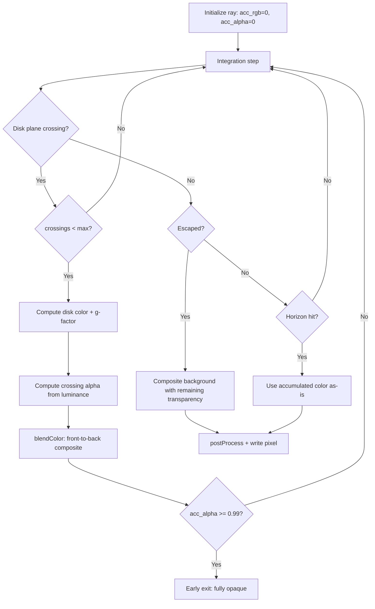
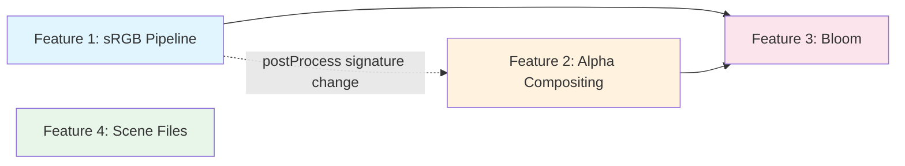
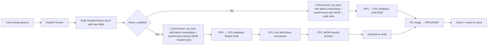

# Nulltracer Feature Plan: 4 New Features

Architecture plan for adopting sRGB color pipeline, alpha-blended disk compositing, Airy disk bloom, and scene save/import from the Starless reference project into Nulltracer's GPU-accelerated CUDA pipeline.

---

## Table of Contents

1. [Parameter Additions](#1-parameter-additions)
2. [Feature 1: Proper sRGB Color Pipeline](#2-feature-1-proper-srgb-color-pipeline)
3. [Feature 2: Alpha-Blended Compositing for Multiple Disk Crossings](#3-feature-2-alpha-blended-compositing-for-multiple-disk-crossings)
4. [Feature 3: Airy Disk Bloom Post-Processing](#4-feature-3-airy-disk-bloom-post-processing)
5. [Feature 4: Scene Save/Import via Config Files](#5-feature-4-scene-saveimport-via-config-files)
6. [Implementation Order](#6-implementation-order)
7. [Files to Modify per Feature](#7-files-to-modify-per-feature)
8. [Render Pipeline Diagram](#8-render-pipeline-diagram)

---

## 1. Parameter Additions

### 1.1 New `RenderParams` Struct Fields

Three new `double` fields appended to the end of the struct. Appending (not inserting) preserves backward compatibility with existing field offsets.

| Field Name | Type | Default | Description |
|---|---|---|---|
| `srgb_output` | `double` | `1.0` | 1.0 = apply proper sRGB transfer function; 0.0 = use simple pow 1/2.2 gamma |
| `disk_alpha` | `double` | `0.8` | Base opacity per disk crossing for alpha compositing; 0.0 = transparent, 1.0 = opaque |
| `disk_max_crossings` | `double` | `3.0` | Maximum number of disk plane crossings to composite per ray |

#### CUDA side — append to `struct RenderParams` in [`geodesic_base.cu`](server/kernels/geodesic_base.cu:34)

```c
/* After existing field: doppler_boost */
double srgb_output;       /* 1=proper sRGB transfer, 0=simple pow(1/2.2) */
double disk_alpha;        /* base opacity per disk crossing (0..1) */
double disk_max_crossings; /* max equatorial plane crossings to composite */
```

#### Python side — append to `RenderParams._fields_` in [`renderer.py`](server/renderer.py:67)

```python
# After existing field: ("doppler_boost", ctypes.c_double)
("srgb_output",       ctypes.c_double),
("disk_alpha",        ctypes.c_double),
("disk_max_crossings", ctypes.c_double),
```

### 1.2 New API Parameters

Added to [`RenderRequest`](server/app.py:46) and [`BenchRequest`](server/app.py:74) Pydantic models:

| Parameter | Type | Default | Constraints | Description |
|---|---|---|---|---|
| `srgb_output` | `bool` | `True` | — | Enable proper sRGB transfer function |
| `disk_alpha` | `float` | `0.8` | `ge=0.0, le=1.0` | Base disk opacity per crossing |
| `disk_max_crossings` | `int` | `3` | `ge=1, le=8` | Max disk crossings to composite |
| `bloom_enabled` | `bool` | `False` | — | Enable Airy disk bloom post-processing |
| `bloom_radius` | `float` | `1.0` | `ge=0.1, le=5.0` | Bloom radius multiplier |

Note: `bloom_enabled` and `bloom_radius` are NOT part of `RenderParams` — they control CPU-side post-processing and are handled in [`renderer.py`](server/renderer.py:221) after the CUDA kernel returns.

### 1.3 New Client State Variables

Added to the `stateRef` object in [`main.js`](js/main.js):

```javascript
srgbOutput: true,
diskAlpha: 0.8,
diskMaxCrossings: 3,
bloomEnabled: false,
bloomRadius: 1.0,
```

---

## 2. Feature 1: Proper sRGB Color Pipeline

### 2.1 Current State

The [`postProcess()`](server/kernels/geodesic_base.cu:326) function in `geodesic_base.cu` currently applies a simple `pow(x, 1/2.2)` gamma curve at lines 371–375:

```c
float inv_gamma = 1.0f / 2.2f;
*cr = powf(fmaxf(*cr, 0.0f), inv_gamma);
*cg = powf(fmaxf(*cg, 0.0f), inv_gamma);
*cb = powf(fmaxf(*cb, 0.0f), inv_gamma);
```

This is an approximation. The proper sRGB transfer function has a linear segment near zero and a power curve above a threshold.

### 2.2 Design

Add a `__device__` function `linear_to_srgb()` in [`geodesic_base.cu`](server/kernels/geodesic_base.cu) that implements the exact sRGB specification from [Wikipedia: sRGB](https://en.wikipedia.org/wiki/SRGB#Specification_of_the_transformation):

```c
__device__ float linear_to_srgb(float c) {
    if (c <= 0.0031308f)
        return 12.92f * c;
    else
        return 1.055f * powf(c, 1.0f / 2.4f) - 0.055f;
}
```

This matches the Starless reference [`rgbtosrgb()`](starless-reference-project/tracer.py:309).

### 2.3 Integration Point

In [`postProcess()`](server/kernels/geodesic_base.cu:326), replace the simple gamma block with a conditional:

```c
/* sRGB output conversion */
if (p.srgb_output > 0.5) {
    *cr = linear_to_srgb(fmaxf(*cr, 0.0f));
    *cg = linear_to_srgb(fmaxf(*cg, 0.0f));
    *cb = linear_to_srgb(fmaxf(*cb, 0.0f));
} else {
    float inv_gamma = 1.0f / 2.2f;
    *cr = powf(fmaxf(*cr, 0.0f), inv_gamma);
    *cg = powf(fmaxf(*cg, 0.0f), inv_gamma);
    *cb = powf(fmaxf(*cb, 0.0f), inv_gamma);
}
```

The `postProcess` function signature must be updated to accept `const RenderParams &p` so it can read `srgb_output`. Currently it receives individual floats — this needs a signature change.

### 2.4 `postProcess` Signature Change

Current signature at [`geodesic_base.cu:326`](server/kernels/geodesic_base.cu:326):
```c
__device__ void postProcess(float *cr, float *cg, float *cb,
                            float alpha, float beta,
                            float spin, float ux, float uy);
```

New signature:
```c
__device__ void postProcess(float *cr, float *cg, float *cb,
                            float alpha, float beta,
                            const RenderParams &p,
                            float ux, float uy);
```

All call sites in every integrator kernel must be updated. The `spin` parameter is replaced by reading `p.spin` inside the function. This also enables future post-processing features to access any `RenderParams` field.

### 2.5 Call Site Updates

Every integrator kernel calls `postProcess` near the end. Example from [`rkdp8.cu:311`](server/kernels/integrators/rkdp8.cu:311):

```c
// Before:
postProcess(&cr, &cg, &cb, alpha, beta, (float)p.spin, ux, uy);
// After:
postProcess(&cr, &cg, &cb, alpha, beta, p, ux, uy);
```

This change applies to all 7 integrator files plus [`ray_trace.cu`](server/kernels/ray_trace.cu).

---

## 3. Feature 2: Alpha-Blended Compositing for Multiple Disk Crossings

### 3.1 Current State

Each integrator uses "first hit wins" with additive attenuation. From [`rkdp8.cu:272-291`](server/kernels/integrators/rkdp8.cu:272):

```c
if (show_disk) {
    double cross = (oldTh - PI * 0.5) * (th - PI * 0.5);
    if (cross < 0.0) {
        /* ... compute disk color dcr, dcg, dcb ... */
        float atten = 1.0f - fminf(sqrtf(cr*cr + cg*cg + cb*cb) * 0.4f, 0.9f);
        cr += dcr * atten; cg += dcg * atten; cb += dcb * atten;
    }
}
```

This has two problems:
1. It does not stop after a maximum number of crossings
2. The attenuation heuristic (`sqrt(luminance) * 0.4`) is not physically motivated

### 3.2 Design: Front-to-Back Alpha Compositing

Replace the ad-hoc attenuation with proper front-to-back alpha compositing, matching the Starless [`blendcolors()`](starless-reference-project/tracer.py:443) and [`blendalpha()`](starless-reference-project/tracer.py:450) functions.

#### Per-Ray State Variables

Add these local variables at the start of each integrator kernel, alongside the existing `cr, cg, cb`:

```c
/* Accumulated color and alpha for front-to-back compositing */
float acc_r = 0.0f, acc_g = 0.0f, acc_b = 0.0f;
float acc_alpha = 0.0f;
int disk_crossings = 0;
int max_crossings = (int)p.disk_max_crossings;
float base_disk_alpha = (float)p.disk_alpha;
```

#### Compositing Math

The front-to-back compositing formula from Starless:

```c
/* ca = front layer color, aalpha = front layer alpha
 * cb = back layer color,  balpha = back layer alpha
 * result_color = ca + cb * balpha * (1 - aalpha)
 * result_alpha = aalpha + balpha * (1 - aalpha) */

__device__ void blendColor(
    float *acc_r, float *acc_g, float *acc_b, float *acc_alpha,
    float new_r, float new_g, float new_b, float new_alpha
) {
    float transparency = 1.0f - *acc_alpha;
    *acc_r += new_r * new_alpha * transparency;
    *acc_g += new_g * new_alpha * transparency;
    *acc_b += new_b * new_alpha * transparency;
    *acc_alpha += new_alpha * transparency;
}
```

This function should be placed in [`geodesic_base.cu`](server/kernels/geodesic_base.cu) so all integrators can use it.

#### Disk Crossing Alpha Computation

Each disk crossing contributes an alpha value based on:
- The `base_disk_alpha` parameter (user-controllable base opacity)
- The disk emission brightness (brighter = more opaque)
- An ISCO taper (fade near inner edge)

```c
/* Compute per-crossing alpha */
float luminance = sqrtf(dcr*dcr + dcg*dcg + dcb*dcb);
float crossing_alpha = base_disk_alpha * fminf(luminance * 2.0f, 1.0f);
```

#### Modified Disk Hit Block

Replace the current disk hit code in each integrator:

```c
if (show_disk && disk_crossings < max_crossings) {
    double cross = (oldTh - PI * 0.5) * (th - PI * 0.5);
    if (cross < 0.0) {
        disk_crossings++;
        double f = fmin(fmax(fabs(oldTh - PI * 0.5) /
                   fmax(fabs(th - oldTh), 1e-14), 0.0), 1.0);
        double r_hit = oldR + f * (r - oldR);
        float dr_f = (float)r_hit;
        float dphi_f = (float)(oldPhi + f * (phi - oldPhi));

        float g = compute_g_factor(r_hit, a, Q2, b);

        float dcr, dcg, dcb;
        diskColor(dr_f, dphi_f, (float)a,
                 (float)p.isco, (float)p.disk_outer, (float)p.disk_temp,
                 g, (int)p.doppler_boost,
                 &dcr, &dcg, &dcb);

        /* Alpha compositing instead of additive attenuation */
        float luminance = sqrtf(dcr*dcr + dcg*dcg + dcb*dcb);
        float crossing_alpha = base_disk_alpha * fminf(luminance * 2.0f, 1.0f);
        blendColor(&acc_r, &acc_g, &acc_b, &acc_alpha,
                   dcr, dcg, dcb, crossing_alpha);
    }
}
```

#### Background Compositing

The background (sky/stars) is composited last with the remaining transparency:

```c
if (r > p.esc_radius) {
    /* ... compute bgr, bgg, bgb as before ... */
    
    /* Composite background behind accumulated disk layers */
    float transparency = 1.0f - acc_alpha;
    acc_r += bgr * transparency;
    acc_g += bgg * transparency;
    acc_b += bgb * transparency;
    
    cr = acc_r; cg = acc_g; cb = acc_b;
    done = true; break;
}
```

#### Horizon Hit

For rays that hit the horizon, the accumulated disk color is the final color (black horizon contributes nothing):

```c
if (r <= rp * 1.01) {
    cr = acc_r; cg = acc_g; cb = acc_b;
    done = true; break;
}
```

#### End-of-Loop Fallback

After the integration loop, if the ray neither escaped nor hit the horizon:

```c
cr = acc_r; cg = acc_g; cb = acc_b;
```

### 3.3 Data Flow Diagram



### 3.4 Early Opacity Cutoff

As an optimization, if `acc_alpha >= 0.99` after a disk crossing, the ray can stop integrating early — further layers would contribute negligibly:

```c
if (acc_alpha >= 0.99f) {
    cr = acc_r; cg = acc_g; cb = acc_b;
    done = true; break;
}
```

---

## 4. Feature 3: Airy Disk Bloom Post-Processing

### 4.1 Approach: CPU-Side Post-Processing

The bloom is a 2D convolution applied AFTER the CUDA ray trace kernel returns. Implementing this on the CPU using NumPy/SciPy is the pragmatic choice because:

1. The convolution kernel size is small relative to the image (typically 25–50px radius)
2. It only runs once per frame, not per-pixel-per-step like the ray tracer
3. SciPy's `convolve2d` is well-optimized and handles boundary conditions
4. It avoids adding complexity to the CUDA kernel compilation pipeline
5. The Starless reference uses exactly this approach

A future GPU optimization could use CuPy's `cupyx.scipy.signal.convolve2d` as a drop-in replacement if CPU performance becomes a bottleneck.

### 4.2 Implementation Location

Add a new module [`server/bloom.py`](server/bloom.py) adapted from [`starless-reference-project/bloom.py`](starless-reference-project/bloom.py):

```python
import numpy as np
from scipy.special import j1
from scipy.signal import fftconvolve

# Spectral scale factors: red diffracts more than blue
SPECTRUM = np.array([1.0, 0.86, 0.61])

def airy_disk(x: np.ndarray) -> np.ndarray:
    """Airy disk intensity pattern: (2*J1(x)/x)^2"""
    # Avoid division by zero at center
    safe_x = np.where(np.abs(x) < 1e-10, 1e-10, x)
    return np.power(2.0 * j1(safe_x) / safe_x, 2)

def generate_kernel(scale: np.ndarray, size: int) -> np.ndarray:
    """Generate (2*size+1, 2*size+1, 3) Airy disk convolution kernel."""
    x = np.arange(-size, size + 1, 1.0)
    xs, ys = np.meshgrid(x, x)
    r = np.sqrt(xs**2 + ys**2) + 1e-10
    kernel = airy_disk(r[:, :, np.newaxis] / scale[np.newaxis, np.newaxis, :])
    kernel /= kernel.sum(axis=(0, 1))[np.newaxis, np.newaxis, :]
    return kernel

def airy_convolve(
    image: np.ndarray,
    radius: float,
    kernel_radius: int = 25,
    fov: float = 8.0,
    width: int = 1280,
) -> np.ndarray:
    """Apply Airy disk bloom to an (H, W, 3) float image.
    
    Args:
        image: Linear RGB float image, shape (H, W, 3)
        radius: User radius multiplier (1.0 = physical default)
        kernel_radius: Pixel radius of convolution kernel
        fov: Field of view in radians-ish (used for diffraction scaling)
        width: Image width in pixels (used for diffraction scaling)
    
    Returns:
        Bloomed image, same shape as input.
    """
    # Physical diffraction radius: 1.22 * 650nm / 4mm aperture
    radd = 0.00019825 * width / np.arctan(fov)
    radd *= radius
    
    # Adaptive kernel size based on max brightness
    max_intensity = np.amax(image)
    if max_intensity < 0.01:
        return image  # Nothing bright enough to bloom
    
    kern_radius = int(
        25 * np.power(max_intensity / 5.0, 1.0/3.0) * width / 1920.0
    )
    kern_radius = max(5, min(kern_radius, 100))  # Clamp
    
    kernel = generate_kernel(radd * SPECTRUM, kern_radius)
    
    out = np.zeros_like(image)
    for ch in range(3):
        out[:, :, ch] = fftconvolve(
            image[:, :, ch], kernel[:, :, ch], mode='same'
        )
    
    return out
```

Key differences from Starless:
- Uses `fftconvolve` instead of `convolve2d` for better performance on larger kernels
- Adds adaptive kernel radius clamping
- Adds early-exit for dark images
- Parameterized by FOV and width for correct physical scaling

### 4.3 Integration into Render Pipeline

The bloom must be applied to **linear RGB** data, BEFORE sRGB conversion. This means the render pipeline needs restructuring:

#### Current Pipeline

```
CUDA kernel → uint8 RGB (with gamma baked in) → PIL Image → JPEG/WebP
```

#### New Pipeline

```
CUDA kernel → float32 linear RGB → [bloom if enabled] → sRGB conversion → uint8 RGB → PIL Image → JPEG/WebP
```

This requires the CUDA kernel to output **float32 linear RGB** instead of uint8 when bloom is enabled. Two approaches:

**Option A: Conditional float output (recommended)**

When bloom is enabled, the kernel writes `float32` RGB to a separate output buffer. The `postProcess` function skips the sRGB/gamma step (it's done CPU-side after bloom). When bloom is disabled, the kernel writes `uint8` as before (no performance regression).

**Option B: Always float output**

Always output float32, always do sRGB on CPU. Simpler but wastes GPU→CPU bandwidth when bloom is off.

#### Option A Implementation Details

1. Add a `bloom_enabled` field to `RenderParams` (as `double`, like all others):

```c
double bloom_enabled;  /* 1=output float32 linear RGB, 0=output uint8 sRGB */
```

2. In `postProcess`, when `bloom_enabled > 0.5`, skip the sRGB/gamma step entirely (the CPU will handle it after bloom).

3. In each integrator kernel, the final pixel write becomes:

```c
if (p.bloom_enabled > 0.5) {
    /* Write float32 linear RGB for CPU-side bloom + sRGB */
    int idx = (iy * W + ix) * 3;
    float *fout = (float *)output;
    fout[idx + 0] = cr;
    fout[idx + 1] = cg;
    fout[idx + 2] = cb;
} else {
    /* Write uint8 sRGB as before */
    int idx = (iy * W + ix) * 3;
    output[idx + 0] = (unsigned char)(fminf(fmaxf(cr * 255.0f, 0.0f), 255.0f));
    output[idx + 1] = (unsigned char)(fminf(fmaxf(cg * 255.0f, 0.0f), 255.0f));
    output[idx + 2] = (unsigned char)(fminf(fmaxf(cb * 255.0f, 0.0f), 255.0f));
}
```

4. In [`renderer.py`](server/renderer.py:221) `render_frame()`, allocate the appropriate output buffer:

```python
if bloom_enabled:
    d_output = cp.zeros(height * width * 3, dtype=cp.float32)
else:
    d_output = cp.zeros(height * width * 3, dtype=cp.uint8)
```

5. After kernel execution, if bloom is enabled:

```python
if bloom_enabled:
    h_float = d_output.get().reshape(height, width, 3)
    h_float = np.flipud(h_float)
    
    # Apply Airy disk bloom in linear space
    from .bloom import airy_convolve
    h_float = airy_convolve(h_float, bloom_radius, fov=fov, width=width)
    
    # Apply sRGB conversion
    h_float = np.clip(h_float, 0.0, None)
    mask = h_float > 0.0031308
    h_float[mask] = 1.055 * np.power(h_float[mask], 1.0/2.4) - 0.055
    h_float[~mask] *= 12.92
    
    # Quantize to uint8
    pixel_array = np.clip(h_float * 255.0, 0, 255).astype(np.uint8)
    return pixel_array.tobytes()
```

### 4.4 Updated `RenderParams` for Bloom

Add one more field to the struct:

| Field Name | Type | Default | Description |
|---|---|---|---|
| `bloom_enabled` | `double` | `0.0` | 1.0 = output float32 linear RGB for CPU bloom; 0.0 = output uint8 sRGB |

This brings the total new struct fields to **4**: `srgb_output`, `disk_alpha`, `disk_max_crossings`, `bloom_enabled`.

### 4.5 Performance Consideration

The bloom convolution on a 1920×1080 image with a 50px kernel radius takes approximately 50–200ms on CPU with `fftconvolve`. This is acceptable for a single-frame render but would be noticeable for interactive use. If needed, the `fftconvolve` can be replaced with CuPy's GPU equivalent:

```python
import cupyx.scipy.signal
# Same API, runs on GPU
```

---

## 5. Feature 4: Scene Save/Import via Config Files

### 5.1 Scene File Format

JSON format, stored in `scenes/` directory on the server. Example:

```json
{
    "name": "high-spin-edge-on",
    "description": "Near-extremal Kerr black hole viewed edge-on",
    "created": "2026-02-20T22:00:00Z",
    "version": 1,
    "params": {
        "spin": 0.99,
        "charge": 0.0,
        "inclination": 85.0,
        "fov": 8.0,
        "method": "rkdp8",
        "steps": 200,
        "step_size": 0.3,
        "obs_dist": 40,
        "bg_mode": 1,
        "show_disk": true,
        "show_grid": true,
        "disk_temp": 1.0,
        "star_layers": 3,
        "phi0": 0.0,
        "doppler_boost": 2,
        "srgb_output": true,
        "disk_alpha": 0.8,
        "disk_max_crossings": 3,
        "bloom_enabled": false,
        "bloom_radius": 1.0
    }
}
```

The `params` object contains exactly the fields from `RenderRequest` (minus `format`, `quality`, `width`, `height` which are session-specific, not scene-specific).

### 5.2 Server-Side API

New endpoints in [`server/app.py`](server/app.py):

#### `GET /scenes` — List all scenes

```python
@app.get("/scenes")
async def list_scenes():
    """List all saved scene files."""
    scenes_dir = Path("scenes")
    scenes_dir.mkdir(exist_ok=True)
    scenes = []
    for f in sorted(scenes_dir.glob("*.json")):
        try:
            data = json.loads(f.read_text())
            scenes.append({
                "name": f.stem,
                "description": data.get("description", ""),
                "created": data.get("created", ""),
            })
        except (json.JSONDecodeError, KeyError):
            continue
    return {"scenes": scenes}
```

#### `GET /scenes/{name}` — Load a scene

```python
@app.get("/scenes/{name}")
async def get_scene(name: str):
    """Load a scene file by name."""
    scene_path = Path("scenes") / f"{name}.json"
    if not scene_path.exists():
        raise HTTPException(status_code=404, detail=f"Scene '{name}' not found")
    try:
        data = json.loads(scene_path.read_text())
        return data
    except json.JSONDecodeError:
        raise HTTPException(status_code=500, detail="Invalid scene file")
```

#### `POST /scenes/{name}` — Save a scene

```python
class SceneSaveRequest(BaseModel):
    description: str = Field("", max_length=500)
    params: dict

@app.post("/scenes/{name}")
async def save_scene(name: str, req: SceneSaveRequest):
    """Save current parameters as a named scene."""
    # Validate name (alphanumeric + hyphens + underscores only)
    if not re.match(r'^[a-zA-Z0-9_-]+$', name):
        raise HTTPException(status_code=400, detail="Invalid scene name")
    
    scenes_dir = Path("scenes")
    scenes_dir.mkdir(exist_ok=True)
    
    scene_data = {
        "name": name,
        "description": req.description,
        "created": datetime.now(timezone.utc).isoformat(),
        "version": 1,
        "params": req.params,
    }
    
    scene_path = scenes_dir / f"{name}.json"
    scene_path.write_text(json.dumps(scene_data, indent=2))
    
    return {"status": "saved", "name": name}
```

#### `DELETE /scenes/{name}` — Delete a scene

```python
@app.delete("/scenes/{name}")
async def delete_scene(name: str):
    """Delete a saved scene."""
    scene_path = Path("scenes") / f"{name}.json"
    if not scene_path.exists():
        raise HTTPException(status_code=404, detail=f"Scene '{name}' not found")
    scene_path.unlink()
    return {"status": "deleted", "name": name}
```

### 5.3 Security Considerations

- Scene names are validated with regex `^[a-zA-Z0-9_-]+$` to prevent path traversal
- The `scenes/` directory path is hardcoded, not user-controllable
- Scene files are limited to JSON format (no arbitrary file writes)
- A maximum scene file size should be enforced (e.g., 10KB)
- Consider adding a maximum number of scenes (e.g., 100)

### 5.4 Client-Side UI

Add a scenes panel to [`index.html`](index.html) with:

1. **Scene dropdown/list** — populated from `GET /scenes`
2. **Load button** — fetches `GET /scenes/{name}` and applies params to all sliders
3. **Save button** — opens a dialog for name + description, sends `POST /scenes/{name}`
4. **Delete button** — confirms and sends `DELETE /scenes/{name}`

#### Client-Side Scene Functions in [`js/server-client.js`](js/server-client.js)

```javascript
export async function listScenes() {
    const resp = await fetch(serverUrl + '/scenes');
    return (await resp.json()).scenes;
}

export async function loadScene(name) {
    const resp = await fetch(serverUrl + '/scenes/' + name);
    return await resp.json();
}

export async function saveScene(name, description, params) {
    const resp = await fetch(serverUrl + '/scenes/' + name, {
        method: 'POST',
        headers: { 'Content-Type': 'application/json' },
        body: JSON.stringify({ description, params }),
    });
    return await resp.json();
}

export async function deleteScene(name) {
    const resp = await fetch(serverUrl + '/scenes/' + name, {
        method: 'DELETE',
    });
    return await resp.json();
}
```

#### Applying a Loaded Scene

When a scene is loaded, the client must:
1. Update all `stateRef` properties from `scene.params`
2. Update all DOM slider/input values to match
3. Trigger a render

This requires a new function in [`js/ui-controller.js`](js/ui-controller.js) that sets all slider values programmatically and calls `requestRender()`.

### 5.5 Bundled Default Scenes

Include 3–5 default scene files in the `scenes/` directory:

| Scene Name | Description |
|---|---|
| `default` | Standard view: a=0.6, θ=80°, moderate settings |
| `high-spin-edge-on` | a=0.99, θ=85° — dramatic frame dragging |
| `schwarzschild` | a=0, Q=0, θ=70° — non-rotating reference |
| `charged` | a=0.3, Q=0.5, θ=75° — Kerr-Newman with visible charge effects |
| `face-on` | a=0.9, θ=10° — nearly face-on view of the disk |

---

## 6. Implementation Order

Features have the following dependency graph:



### Recommended Sequence

1. **Feature 1: sRGB Pipeline** — Do this first because:
   - It requires the `postProcess` signature change that Feature 2 also needs
   - It adds the first new `RenderParams` fields, establishing the pattern
   - It's the simplest feature (one new function, one conditional)
   - All subsequent features build on the updated `postProcess` signature

2. **Feature 2: Alpha Compositing** — Do this second because:
   - It modifies the integration loop in every kernel (the most invasive change)
   - It adds `disk_alpha` and `disk_max_crossings` to `RenderParams`
   - The bloom feature needs correct multi-crossing colors to look right

3. **Feature 3: Bloom Post-Processing** — Do this third because:
   - It depends on Feature 1 (needs the sRGB toggle to work correctly — bloom operates in linear space)
   - It depends on Feature 2 (multi-crossing disk colors produce the bright pixels that bloom acts on)
   - It adds the float32 output path and CPU post-processing pipeline

4. **Feature 4: Scene Files** — Do this last because:
   - It's completely independent of the rendering pipeline
   - It needs all new parameters to exist so scenes can save/load them
   - It's the lowest-risk feature (no CUDA changes)

---

## 7. Files to Modify per Feature

### Feature 1: sRGB Pipeline

| File | Changes |
|---|---|
| [`server/kernels/geodesic_base.cu`](server/kernels/geodesic_base.cu) | Add `linear_to_srgb()` function; add `srgb_output` to `RenderParams` struct; update `postProcess` signature and body |
| [`server/renderer.py`](server/renderer.py) | Add `srgb_output` to Python `RenderParams._fields_`; pass `srgb_output` when building struct |
| [`server/app.py`](server/app.py) | Add `srgb_output` to `RenderRequest` and `BenchRequest` models |
| [`server/kernels/integrators/rk4.cu`](server/kernels/integrators/rk4.cu) | Update `postProcess` call site |
| [`server/kernels/integrators/rkdp8.cu`](server/kernels/integrators/rkdp8.cu) | Update `postProcess` call site |
| [`server/kernels/integrators/kahanli8s.cu`](server/kernels/integrators/kahanli8s.cu) | Update `postProcess` call site |
| [`server/kernels/integrators/kahanli8s_ks.cu`](server/kernels/integrators/kahanli8s_ks.cu) | Update `postProcess` call site |
| [`server/kernels/integrators/tao_yoshida4.cu`](server/kernels/integrators/tao_yoshida4.cu) | Update `postProcess` call site |
| [`server/kernels/integrators/tao_yoshida6.cu`](server/kernels/integrators/tao_yoshida6.cu) | Update `postProcess` call site |
| [`server/kernels/integrators/tao_kahan_li8.cu`](server/kernels/integrators/tao_kahan_li8.cu) | Update `postProcess` call site |
| [`server/kernels/ray_trace.cu`](server/kernels/ray_trace.cu) | Update `postProcess` call site |
| [`js/ui-controller.js`](js/ui-controller.js) | Add sRGB toggle control |
| [`js/server-client.js`](js/server-client.js) | Add `srgb_output` to `buildServerParams()` |
| [`js/main.js`](js/main.js) | Add `srgbOutput` to state |
| [`index.html`](index.html) | Add sRGB toggle checkbox |

### Feature 2: Alpha Compositing

| File | Changes |
|---|---|
| [`server/kernels/geodesic_base.cu`](server/kernels/geodesic_base.cu) | Add `blendColor()` device function; add `disk_alpha`, `disk_max_crossings` to `RenderParams` |
| [`server/renderer.py`](server/renderer.py) | Add `disk_alpha`, `disk_max_crossings` to Python `RenderParams._fields_`; pass values when building struct |
| [`server/app.py`](server/app.py) | Add `disk_alpha`, `disk_max_crossings` to `RenderRequest` and `BenchRequest` |
| [`server/kernels/integrators/rk4.cu`](server/kernels/integrators/rk4.cu) | Replace disk hit block with alpha compositing; add per-ray state vars |
| [`server/kernels/integrators/rkdp8.cu`](server/kernels/integrators/rkdp8.cu) | Same |
| [`server/kernels/integrators/kahanli8s.cu`](server/kernels/integrators/kahanli8s.cu) | Same |
| [`server/kernels/integrators/kahanli8s_ks.cu`](server/kernels/integrators/kahanli8s_ks.cu) | Same |
| [`server/kernels/integrators/tao_yoshida4.cu`](server/kernels/integrators/tao_yoshida4.cu) | Same |
| [`server/kernels/integrators/tao_yoshida6.cu`](server/kernels/integrators/tao_yoshida6.cu) | Same |
| [`server/kernels/integrators/tao_kahan_li8.cu`](server/kernels/integrators/tao_kahan_li8.cu) | Same |
| [`server/kernels/ray_trace.cu`](server/kernels/ray_trace.cu) | Same |
| [`js/ui-controller.js`](js/ui-controller.js) | Add disk alpha slider and max crossings control |
| [`js/server-client.js`](js/server-client.js) | Add `disk_alpha`, `disk_max_crossings` to `buildServerParams()` |
| [`js/main.js`](js/main.js) | Add `diskAlpha`, `diskMaxCrossings` to state |
| [`index.html`](index.html) | Add disk alpha slider and max crossings dropdown |

### Feature 3: Bloom Post-Processing

| File | Changes |
|---|---|
| [`server/bloom.py`](server/bloom.py) | **New file** — Airy disk bloom implementation |
| [`server/kernels/geodesic_base.cu`](server/kernels/geodesic_base.cu) | Add `bloom_enabled` to `RenderParams`; conditional sRGB skip in `postProcess` |
| [`server/renderer.py`](server/renderer.py) | Add `bloom_enabled` to Python `RenderParams._fields_`; add float32 output path; integrate bloom + CPU sRGB conversion |
| [`server/app.py`](server/app.py) | Add `bloom_enabled`, `bloom_radius` to `RenderRequest` and `BenchRequest` |
| [`server/kernels/integrators/rk4.cu`](server/kernels/integrators/rk4.cu) | Add conditional float32 output write |
| [`server/kernels/integrators/rkdp8.cu`](server/kernels/integrators/rkdp8.cu) | Same |
| [`server/kernels/integrators/kahanli8s.cu`](server/kernels/integrators/kahanli8s.cu) | Same |
| [`server/kernels/integrators/kahanli8s_ks.cu`](server/kernels/integrators/kahanli8s_ks.cu) | Same |
| [`server/kernels/integrators/tao_yoshida4.cu`](server/kernels/integrators/tao_yoshida4.cu) | Same |
| [`server/kernels/integrators/tao_yoshida6.cu`](server/kernels/integrators/tao_yoshida6.cu) | Same |
| [`server/kernels/integrators/tao_kahan_li8.cu`](server/kernels/integrators/tao_kahan_li8.cu) | Same |
| [`server/kernels/ray_trace.cu`](server/kernels/ray_trace.cu) | Same |
| [`server/requirements.txt`](server/requirements.txt) | Add `scipy` dependency |
| [`js/ui-controller.js`](js/ui-controller.js) | Add bloom toggle and radius slider |
| [`js/server-client.js`](js/server-client.js) | Add `bloom_enabled`, `bloom_radius` to `buildServerParams()` |
| [`js/main.js`](js/main.js) | Add `bloomEnabled`, `bloomRadius` to state |
| [`index.html`](index.html) | Add bloom controls |

### Feature 4: Scene Files

| File | Changes |
|---|---|
| [`server/app.py`](server/app.py) | Add `SceneSaveRequest` model; add 4 scene endpoints; add `re` import |
| [`js/server-client.js`](js/server-client.js) | Add `listScenes()`, `loadScene()`, `saveScene()`, `deleteScene()` functions |
| [`js/ui-controller.js`](js/ui-controller.js) | Add `applyScene()` function to set all sliders from loaded params; add scene panel event handlers |
| [`js/main.js`](js/main.js) | Initialize scene panel on startup |
| [`index.html`](index.html) | Add scenes panel UI with list, save dialog, load/delete buttons |
| [`styles.css`](styles.css) | Style the scenes panel |
| `scenes/default.json` | **New file** — bundled default scene |
| `scenes/high-spin-edge-on.json` | **New file** — bundled scene |
| `scenes/schwarzschild.json` | **New file** — bundled scene |

---

## 8. Render Pipeline Diagram

### Current Pipeline


### New Pipeline with All Features



### WebSocket Path

The WebSocket path in [`js/ws-client.js`](js/ws-client.js) also needs the new parameters added to its `sendParams()` function. The same `buildServerParams()` pattern should be reused or the WS client should call the shared param builder.

---

## Appendix: Complete New `RenderParams` Struct

After all 4 features, the struct has 4 new fields appended:

```c
struct RenderParams {
    /* Resolution */
    double width;
    double height;

    /* Black hole parameters */
    double spin;
    double charge;
    double incl;
    double fov;
    double phi0;
    double isco;

    /* Integration parameters */
    double steps;
    double obs_dist;
    double esc_radius;
    double disk_outer;
    double step_size;

    /* Rendering options (existing) */
    double bg_mode;
    double star_layers;
    double show_disk;
    double show_grid;
    double disk_temp;
    double doppler_boost;

    /* NEW: sRGB + compositing + bloom */
    double srgb_output;        /* 1=proper sRGB, 0=simple gamma */
    double disk_alpha;         /* base opacity per disk crossing */
    double disk_max_crossings; /* max equatorial crossings to composite */
    double bloom_enabled;      /* 1=float32 output for CPU bloom */
};
```

Python side:
```python
_fields_ = [
    # ... existing 20 fields ...
    ("srgb_output",        ctypes.c_double),
    ("disk_alpha",         ctypes.c_double),
    ("disk_max_crossings", ctypes.c_double),
    ("bloom_enabled",      ctypes.c_double),
]
```

Total struct size: 24 × 8 = 192 bytes (was 20 × 8 = 160 bytes).
