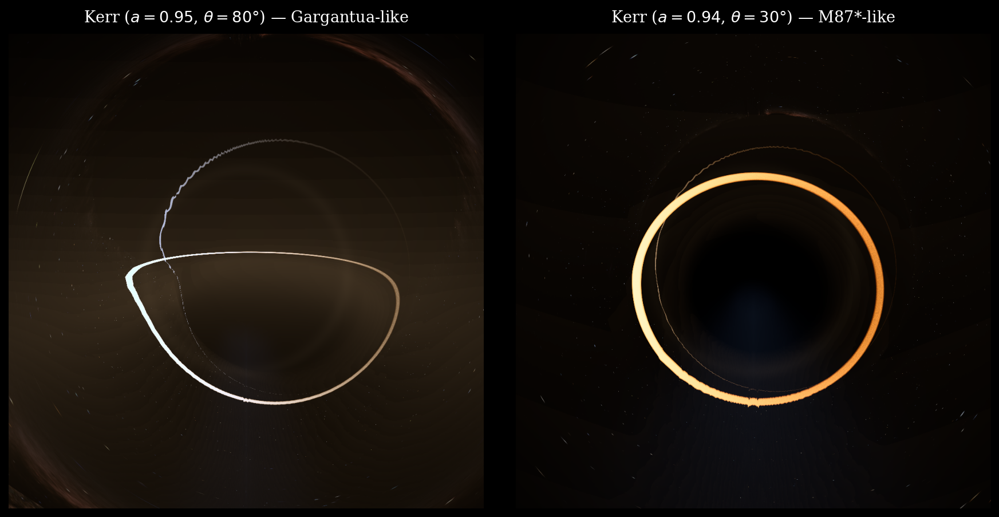

# Nulltracer

**GPU-accelerated ray tracing through curved spacetimes**

Nulltracer is a CUDA-powered ray tracer that visualises black holes by tracing null geodesics through Kerr-Newman spacetime. It renders photon rings, gravitational lensing, accretion-disk Doppler effects, and frame-dragging with `float64` precision. The repository offers a Python package (`nulltracer/`) exposing `render_frame()`, `shadow_boundary()`, `trace_ray()`, `extract_shadow_metrics()`, and related utilities for analysis, notebooks, and batch scripts.



## Physics & Numerical Methods

### Kerr-Newman metric

Nulltracer solves null geodesics in the Kerr-Newman spacetime, which describes the curved spacetime around a rotating, electrically charged black hole. In Boyer-Lindquist coordinates $(t, r, \theta, \phi)$, geometric units $M = 1$,

$$ds^2 = - \left(1 - \frac{\beta}{\Sigma}\right) dt^2 - \frac{2a\beta\sin^2\theta}{\Sigma}\,dt\,d\phi + \frac{\Sigma}{\Delta}\,dr^2 + \Sigma\,d\theta^2 + \sin^2\theta \left(r^2+a^2+\frac{a^2\beta\sin^2\theta}{\Sigma} \right) d\phi^2,$$

where $\beta=2r-Q^2$, $\Sigma = r^2 + a^2 \cos^2\theta$, and $\Delta = r^2 - 2r + a^2 + Q^2$. Geodesics are integrated in Hamiltonian form using conserved energy $E$, angular momentum $L_z$, and the Carter constant $\mathcal{Q}$.

### Integration methods

Seven integrators are available via `method=...`:

- `rk4` — classical 4th-order Runge-Kutta; robust and fast for moderate accuracy.
- `rkdp8` — adaptive 8th-order Runge-Kutta-Dormand-Prince; automatically adjusts step size.
- `kahanli8s` — 8th-order symplectic with Kahan-Li composition and Sundman time transformation; the default for high-quality long-orbit renders.
- `kahanli8s_ks` — variant in Kerr-Schild coordinates for improved near-horizon behaviour.
- `tao_yoshida4` — 4th-order symplectic Tao-Yoshida in extended phase space.
- `tao_yoshida6` — 6th-order Tao-Yoshida.
- `tao_kahan_li8` — 8th-order combining Tao's extended phase space with a Kahan-Li corrector.

The Sundman time transformation concentrates steps near the black hole, which combined with symplecticity is important for capturing sub-leading photon-ring sub-images ($n \ge 1$).

### Accretion-disk model

The disk follows a Novikov-Thorne temperature profile with $T \propto r^{-3/4}$ outside ISCO and a plunging-region continuation inside. Relativistic Doppler boosting applies either $g^3$ (optically thin) or $g^4$ (optically thick) bolometric factors. Multiple equatorial crossings are accumulated via alpha-compositing (set `disk_max_crossings > 1` to build up photon-ring sub-images). 

Beyond the thin-disk model, the kernel supports volumetric emitters:
- **Corona** — hot electron scattering layer above the disk with scale height $h = 0.3\,r_{\rm cyl}$.
- **Relativistic jet** — collimated outflow along the spin axis.

### Post-processing

An Airy-disk bloom (`nulltracer.bloom.apply_bloom`) can be applied to convolve the linear-light image with the diffraction pattern of a circular aperture, adding a physically motivated halo around bright features. The output is finally transformed to sRGB for standard displays.

### Numerical precision

Geodesic integration and metric evaluation are `float64`. Colour arithmetic is `float32`. The final image is quantised to `uint8` per channel after tone mapping and the sRGB transfer function.

## Quick Start

### As a Python package (recommended for analysis)

```bash
pip install -e ".[analysis,notebook]"
```

```python
import nulltracer as nt
import numpy as np

# Render an image — returns (H, W, 3) uint8 numpy array + RenderInfo dataclass
img, info = nt.render_frame(spin=0.94, inclination_deg=30)

# Pre-compile all CUDA kernels up front to avoid first-call latency
nt.compile_all()

# Analytic shadow boundary (Kerr or Kerr-Newman)
alpha, beta_plus, beta_minus = nt.shadow_boundary(a=0.6, theta_obs=np.radians(60.0), Q=0.0)
```

See `notebooks/nulltracer.ipynb` for the full EHT-validation walkthrough.

### As a web server (for interactive exploration)

```bash
pip install -e ".[server]"
uvicorn nulltracer.server:app --host 0.0.0.0 --port 8420
```

Open `web/index.html` in a browser. The client auto-detects the server at `/health`.

> The FastAPI server module is under active consolidation; see `DEPLOYMENT.md` for the current deployment story (Caddy reverse-proxy + Docker on Unraid).

### Running tests

```bash
pip install -r tests/requirements-test.txt
pytest tests/ -v
```

Pure-Python tests (ISCO, shadow-boundary analytics, shadow-extraction primitives) run on any machine. Tests that import `nulltracer.renderer` skip gracefully if CuPy is absent (CPU-only CI is supported).

## API Reference

### Rendering

```python
# Full visual pipeline → (H, W, 3) uint8 sRGB image + RenderInfo
img, info = nt.render_frame(spin, inclination_deg, **kwargs)

# Or use the dict-based CudaRenderer directly (used by the server and notebook)
renderer = nt.CudaRenderer()
renderer.initialize()
timed = renderer.render_frame_timed({'spin': 0.94, 'inclination': 30, 'width': 512, 'height': 512})
# timed['raw_rgb'], timed['kernel_ms'], etc.

# Shadow classification → boolean (H, W) mask + ClassifyInfo
mask, info = nt.classify_shadow(spin, inclination_deg, **kwargs)

# Single-ray diagnostic → dict with trajectory, crossings, physics
data = nt.trace_ray(spin=0.6, mode="impact_parameter", alpha=5.0, beta=0.0)
```

### Utilities

```python
nt.compile_all()                                   # pre-compile all CUDA kernels
nt.available_methods()                             # list integrator names
nt.isco(a, Q=0.0)                                  # ISCO radius
nt.isco_kerr(a)                                    # Kerr-only ISCO (Bardeen, Press & Teukolsky 1972)
nt.shadow_boundary(a, theta_obs, Q=0.0, N=1000)    # Analytic Kerr-Newman contour
nt.extract_shadow_metrics(img, fov_deg=7.0)        # Circle & ellipse fits → EHT observables
nt.load_skymap("path/to/skymap.exr")               # Load background texture
results, fig = nt.compare_integrators(spin=0.9)    # Side-by-side integrator benchmark
```

### Server /render endpoint (example)

```json
POST /render
{
  "spin": 0.6,
  "charge": 0.0,
  "inclination": 80.0,
  "fov": 8.0,
  "width": 1280,
  "height": 720,
  "method": "rkdp8",
  "step_size": 0.3,
  "obs_dist": 40,
  "bg_mode": 1,
  "show_disk": true,
  "show_grid": false,
  "disk_temp": 1.0,
  "star_layers": 4,
  "srgb_output": true,
  "bloom_enabled": false,
  "format": "jpeg",
  "quality": 90
}
```

Response: binary JPEG/WebP image with appropriate `Content-Type`.

The `inclination` key also accepts the shorthand alias `incl`. If `steps` is omitted, the server calls `auto_steps(obs_dist, step_size, spin, charge, method)` to size the integration budget — important for large observer distances (e.g. `obs_dist=500` at `step_size=0.15` needs ≫ 200 steps to reach the black hole).

*Note on units:* The `fov` parameter (historically labeled `fov_deg` in `extract_shadow_metrics`) is not an angle; it specifies the screen half-width in units of $M$ (gravitational radii), setting the impact-parameter window $u_x \in [-1, 1] \mapsto \alpha \in [-\text{fov}, \text{fov}] \cdot M$.

## Controls (web client)

- **Spin (a)** — black-hole rotation, $0 \le a < 1$.
- **Charge (Q)** — Kerr-Newman electric charge, $a^2 + Q^2 < 1$.
- **Inclination (θ)** — observer viewing angle relative to the spin axis.
- **Disk Temperature** — colour-temperature multiplier for the accretion disk.
- **Quality Preset** — Low / Medium / High / Ultra.
- **Integration Method** — `rk4`, `rkdp8`, `kahanli8s`, `kahanli8s_ks`, `tao_yoshida4/6`, `tao_kahan_li8`.
- **Integration Steps** — ray-tracing budget (auto-sized by `auto_steps` when unspecified).
- **Step Size** — base affine-parameter step.
- **Observer Distance** — distance from the black hole in $M$.
- **Background Mode** — stars (procedural), checker, colormap, or loaded skymap.

## Project Structure

```
nulltracer/
├── nulltracer/                  # Python package
│   ├── __init__.py              # Lazy-loading public API
│   ├── _kernel_utils.py         # KernelCache; compile-on-demand logic
│   ├── _params.py               # RenderParams ctypes struct
│   ├── bloom.py                 # Airy-disk bloom post-processing
│   ├── compare.py               # shadow_boundary, compare_integrators, fit_ellipse_to_shadow
│   ├── eht_validation.py        # extract_shadow_metrics (circle + ellipse fits)
│   ├── isco.py                  # isco_kerr, isco_kn, isco
│   ├── ray.py                   # trace_ray (single-ray diagnostic)
│   ├── render.py                # render_frame, classify_shadow, auto_steps
│   ├── renderer.py              # CudaRenderer class (dict-based API for server)
│   ├── skymap.py                # load_skymap, equirectangular texture support
│   └── kernels/
│       ├── geodesic_base.cu     # Metric functions, initialisation, termination
│       ├── backgrounds.cu       # Stars, checker, colormap, skymap
│       ├── disk.cu              # Novikov-Thorne emission, Planck LUT, Doppler
│       ├── ray_trace.cu         # Single-ray trajectory kernels
│       └── integrators/
│           ├── rk4.cu
│           ├── rkdp8.cu
│           ├── kahanli8s.cu
│           ├── kahanli8s_ks.cu
│           ├── tao_yoshida4.cu
│           ├── tao_yoshida6.cu
│           ├── tao_kahan_li8.cu
│           ├── adaptive_step.cu
│           └── steps.cu
├── notebooks/
│   └── nulltracer.ipynb         # Hero EHT-validation notebook (§1-12)
├── tests/
│   ├── conftest.py
│   ├── requirements-test.txt
│   ├── test_isco.py             # ISCO analytic checks
│   ├── test_shadow.py           # Schwarzschild shadow radius
│   ├── test_shadow_boundary.py  # Kerr / K-N / RN contours
│   ├── test_renderer_params.py  # P1 regression: incl alias, auto_steps
│   └── test_eht_validation.py   # Circle/ellipse fitting sanity
├── scripts/
│   └── execute_notebook.sh      # nbconvert helper for GPU hosts
├── scenes/                      # Preset JSON parameter sets
│   ├── default.json
│   ├── schwarzschild.json
│   ├── extreme-kerr.json
│   ├── charged-black-hole.json
│   └── face-on.json
├── assets/                      # Skymap textures (Gaia, Hipparcos/Tycho-2)
├── web/                         # Browser client
│   ├── index.html
│   ├── styles.css
│   └── js/{main,server-client,ui-controller,ws-client}.js
├── ARCHITECTURE.md              # Technical deep-dive
├── DEPLOYMENT.md                # Caddy / Docker / Unraid deployment
├── README.md                    # This file
├── LICENSE                      # MIT
└── pyproject.toml
```

## Version History

| Version | Date | Highlights |
|---------|------|------------|
| v0.0.1 | 2026-02-17 | Initial Kerr black hole with Hamiltonian RK4 integration |
| v0.1 | 2026-02-17 | Refactor to separated first-order equations (~40% faster) |
| v0.2 | 2026-02-17 | UX overhaul: legend, settings panel, multiple backgrounds |
| v0.3 | 2026-02-17 | Equal-area sphere tiling (fixes polar pinching) |
| v0.4 | 2026-02-17 | Numerical stability improvements |
| v0.5 | 2026-02-17 | Smooth regularisation and cube-map projection |
| v0.6 | 2026-02-17 | $\mu=\cos\theta$ coordinate substitution for pole handling |
| v0.7 | 2026-02-17 | Adaptive stepping refinements |
| v0.8 | 2026-02-17 | Kerr-Newman extension (electric-charge parameter) |
| v0.9 | 2026-02-17 | Polished Kerr-Newman release |
| — | 2026-04-22 | P1-P7 publication-readiness series: API-contract fixes, hero-notebook rebuild, K-N shadow analytic, tests |

## Requirements

- **Python ≥ 3.10**
- **NVIDIA GPU** with CUDA support (required for rendering; pure analytics like `isco_kerr`, `shadow_boundary` run CPU-only)
- **CuPy** (`cupy-cuda12x` for CUDA 12.x)
- NumPy, SciPy, Matplotlib
- FastAPI, Uvicorn (server extras)
- Pillow, imageio, OpenEXR (optional for skymap and image I/O)

## License

MIT License. See [LICENSE](LICENSE).

## Author

Ethan Knox — [ethank5149@gmail.com](mailto:ethank5149@gmail.com) — [github.com/ethank5149](https://github.com/ethank5149)
