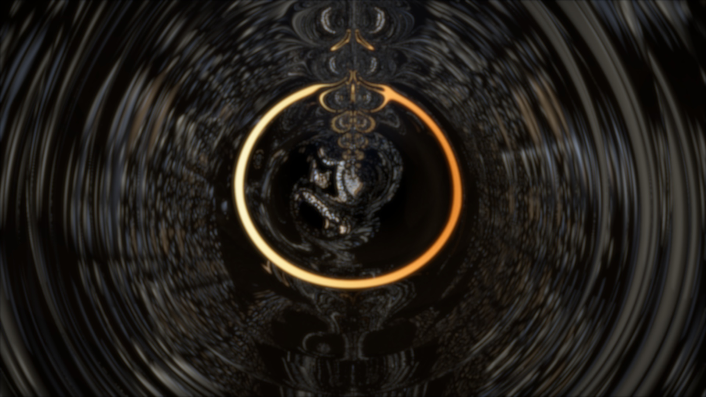
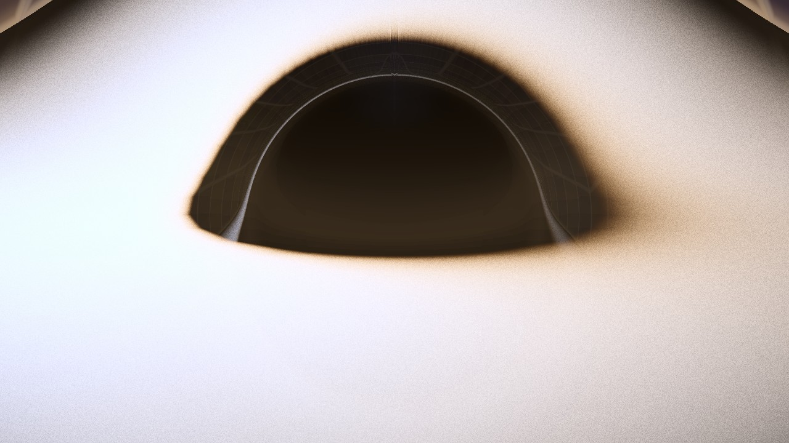
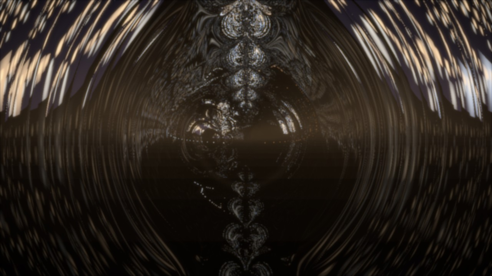
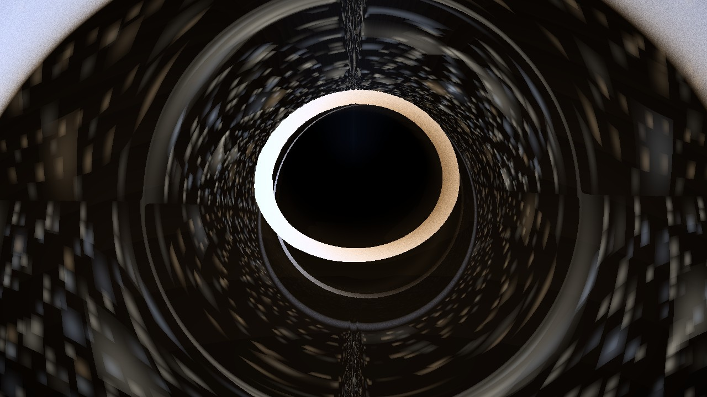

# Nulltracer

**GPU-accelerated ray tracing through curved spacetimes**



Nulltracer is a CUDA-powered application that visualizes black holes by tracing null geodesics through Kerr-Newman spacetime. It renders photon rings, gravitational lensing, accretion disk Doppler effects, and frame-dragging with float64 precision. A FastAPI server performs all computation on GPU; a thin browser client provides interactive parameter controls.

[](https://github.com/ethank5149/nulltracer/actions/workflows/ci.yml)

## Gallery

<!-- TODO: Replace placeholders with actual renders once GPU server is available -->

| Schwarzschild (a=0) — checker background | Extreme Kerr (a=0.998) — edge-on |
|---|---|
|  |  |

| Kerr-Newman (a=0.5, Q=0.7) | Additional view |
|---|---|
|  | <!-- TODO: fourth render --> |

## Physics & Numerical Methods

### Kerr-Newman Metric

Nulltracer solves null geodesics in the Kerr-Newman spacetime, which describes the curved spacetime around a rotating, electrically charged black hole. In Boyer-Lindquist coordinates \((t, r, \theta, \phi)\), the metric is

\[
\begin{aligned}
ds^2 = &- \left(1 - \frac{2Mr - Q^2}{\Sigma}\right) dt^2
- \frac{2a(2Mr - Q^2)\sin^2\theta}{\Sigma} \, dt\,d\phi
+ \frac{\Sigma}{\Delta}\,dr^2 + \Sigma\,d\theta^2 \\
&+ \sin^2\theta \left( r^2 + a^2 + \frac{a^2(2Mr - Q^2)\sin^2\theta}{\Sigma} \right) d\phi^2,
\end{aligned}
\]

where \(\Sigma = r^2 + a^2 \cos^2\theta\), \(\Delta = r^2 - 2Mr + a^2 + Q^2\), and \(M=1\) in geometric units. Geodesic equations are integrated in Hamiltonian form using conserved energy \(E\) and angular momentum \(L_z\).

### Integration Methods

Seven integrators are available, each with different characteristics:

| Method | Description |
|--------|-------------|
| `rk4` | Classical 4th-order Runge-Kutta; robust and fast for moderate accuracy needs |
| `rkdp8` | Adaptive 8th-order Runge-Kutta-Dormand-Prince; automatically adjusts step size for efficiency |
| `kahanli8s` | 8th-order symplectic integrator using Kahan–Li composition with Sundman time transformation; excellent long-term accuracy and energy conservation |
| `kahanli8s_ks` | Variant using Kerr–Schild coordinates for improved behavior near the horizon |
| `tao_yoshida4` | 4th-order symplectic Tao–Yoshida method in extended phase space |
| `tao_yoshida6` | 6th-order symplectic Tao–Yoshida method |
| `tao_kahan_li8` | 8th-order symplectic combining Tao's extended phase space with Kahan–Li corrector |

The **`kahanli8s`** integrator (default for high-quality renders) combines a 4th-order symplectic subdivision (Kahan–Li) with a Sundman time transformation to concentrate steps near the black hole, plus a symplectic corrector to maintain accuracy over long integration lengths. This yields excellent energy conservation and minimal numerical dissipation, critical for capturing fine photon-ring structures.

### Accretion Disk Model

The disk emission follows the Novikov–Thorne thin-disk model with a blackbody spectrum. Temperature scales as \(T \propto r^{-3/4}\) modified by relativistic Doppler boosting (\(g^3\) for optically thin, \(g^4\) for thick disks). Each ray crossing the disk accumulates radiance with alpha blending; multiple crossings (up to `disk_max_crossings`) are supported for realistic limb darkening and back-side contributions. Color output is transformed to sRGB for standard displays.

### Numerical Precision

All geodesic integration and metric evaluations use **float64** (double precision) to avoid drift and ensure accurate shadow boundaries. Intermediate color calculations are performed in float32; the final image is quantized to **uint8** per channel after tone mapping and gamma correction.

## Features

- **Kerr–Newman metric** — rotating, electrically charged black holes in Boyer-Lindquist coordinates
- **Seven integration methods** — RK4, Dormand–Prince 8(7) adaptive, Yoshida 4th/6th-order symplectic, Kahan–Li 8th-order symplectic (BL and Kerr–Schild), Tao + Kahan–Li 8th symplectic
- **Production CUDA kernels** — float64 geodesic integration, one thread per pixel, compiled via CuPy `RawKernel`
- **Accretion disk physics** — Doppler boosting (g³ thin / g⁴ thick), colour temperature, multi-crossing accumulation
- **Shadow classification** — dedicated lightweight kernel for quantitative shadow measurement against Bardeen (1973) analytic curves
- **Single-ray diagnostics** — full trajectory, equatorial-plane crossings, g-factors, Novikov–Thorne flux per crossing
- **Equirectangular skymap backgrounds** — Gaia EDR3, Hipparcos/Tycho-2, or custom HDR environments
- **Airy disk bloom** — physically motivated diffraction post-processing

## Quick Start

### Docker (recommended)

```bash
cd server
docker build -t nulltracer-server .
docker run --gpus all -p 8420:8420 nulltracer-server
```

### Local

```bash
cd server
pip install -r requirements.txt
uvicorn app:app --host 0.0.0.0 --port 8420
```

Open `index.html` in a browser. The client auto-detects the server at `/health`.

## API Reference

### Rendering

```python
# Full visual pipeline → (H, W, 3) uint8 sRGB image
img, info = nt.render_frame(spin, inclination_deg, **kwargs)

# Shadow classification → boolean (H, W) mask
mask, info = nt.classify_shadow(spin, inclination_deg, **kwargs)

# Single-ray diagnostic → dict with trajectory, crossings, physics
data = nt.trace_ray(spin=0.6, mode="impact_parameter", alpha=5.0, beta=0.0)
```

### Utilities

```python
nt.compile_all()                         # pre-compile all CUDA kernels
nt.available_methods()                   # list integrator names
nt.isco(a, Q=0.0)                       # ISCO radius
nt.r_plus(a, Q=0.0)                     # event horizon radius
nt.shadow_boundary(a, theta_obs, N=1000) # Bardeen analytic contour
nt.load_skymap("path/to/skymap.exr")    # load background texture
results, fig = nt.compare_integrators() # side-by-side benchmark
```

#### Example: Render Request

```json
POST /render
{
  "spin": 0.6,
  "charge": 0.0,
  "inclination": 80.0,
  "fov": 8.0,
  "width": 1280,
  "height": 720,
  "method": "rkdp8",
  "steps": 200,
  "step_size": 0.3,
  "obs_dist": 40,
  "bg_mode": 1,
  "show_disk": true,
  "show_grid": false,
  "disk_temp": 1.0,
  "star_layers": 4,
  "srgb_output": true,
  "bloom_enabled": false,
  "format": "jpeg",
  "quality": 90
}
```

Response: binary JPEG/WebP image with appropriate `Content-Type`.

## Deployment

For production deployment with Caddy reverse proxy, Docker Compose, or Unraid, see [DEPLOYMENT.md](DEPLOYMENT.md).

## Controls

- **Spin (a):** Adjust black hole rotation from 0 (non-rotating Schwarzschild) to near-maximal values
- **Charge (Q):** Set electric charge parameter for Kerr-Newman black holes
- **Inclination (θ):** Change observer viewing angle relative to the black hole's rotation axis
- **Disk Temperature:** Adjust the color temperature of the accretion disk
- **Quality Preset:** Choose from Low/Medium/High/Ultra to balance visual fidelity and performance
- **Integration Method:** Select between different integration algorithms (RK4, Yoshida, RKDP8, Kahan–Li, etc.)
- **Integration Steps:** Control ray-tracing precision
- **Step Size:** Adjust base affine-parameter step (smaller → more accurate near horizon)
- **Observer Distance:** Set distance from black hole in gravitational radii
- **Background Mode:** Switch between stars, checker, colormap, or skymap

## Project Structure

```
nulltracer/
├── server/                   # FastAPI backend
│   ├── app.py                # API endpoints
│   ├── renderer.py           # CUDA rendering engine
│   ├── isco.py               # ISCO calculations
│   ├── cache.py              # LRU cache
│   ├── bloom.py              # Bloom post-processing
│   ├── scenes.py             # Scene management
│   ├── requirements.txt      # Python dependencies
│   ├── Dockerfile            # Container build
│   ├── kernels/              # CUDA kernels
│   │   ├── geodesic_base.cu
│   │   ├── backgrounds.cu
│   │   ├── disk.cu
│   │   ├── ray_trace.cu
│   │   └── integrators/
│   │       ├── rk4.cu
│   │       ├── rkdp8.cu
│   │       ├── kahanli8s.cu
│   │       ├── kahanli8s_ks.cu
│   │       ├── tao_yoshida4.cu
│   │       ├── tao_yoshida6.cu
│   │       └── tao_kahan_li8.cu
│   └── scenes/               # JSON scene files
├── js/                       # Browser client
│   ├── main.js
│   ├── server-client.js
│   └── ui-controller.js
├── docs/
│   └── images/               # Rendered hero & gallery (pending GPU)
├── assets/                   # Static assets (icons, benchmark, templates)
│   ├── nulltracer-icon.png
│   ├── nulltracer-icon.svg
│   ├── schwarzschild-black-hole-nasa-labeled-reference.jpg
│   ├── bench.html
│   └── nulltracer-renderer.xml
├── index.html                # Client UI
├── styles.css                # Styles
├── docker-compose.yml        # Docker Compose config
├── deploy.sh                 # Deployment script
├── .gitignore
├── nulltracer.ipynb          # Main notebook
├── ARCHITECTURE.md           # Technical deep-dive
├── FEATURE-PLAN.md           # Feature roadmap
├── README.md
├── LICENSE
├── DEPLOYMENT.md             # Deployment details
└── .github/
    └── workflows/
        └── ci.yml            # Continuous integration
```

## Version History

| Version | Date | Highlights |
|---------|------|------------|
| v0.0.1 | 2026-02-17 | Initial Kerr black hole with Hamiltonian RK4 integration |
| v0.1 | 2026-02-17 | Refactor to separated first-order equations (~40% faster) |
| v0.2 | 2026-02-17 | UX overhaul: legend, settings panel, multiple backgrounds |
| v0.3 | 2026-02-17 | Equal-area sphere tiling (fixes polar pinching) |
| v0.4 | 2026-02-17 | Numerical stability improvements |
| v0.5 | 2026-02-17 | Smooth regularization and cube-map projection |
| v0.6 | 2026-02-17 | μ=cos(θ) coordinate substitution for pole handling |
| v0.7 | 2026-02-17 | Adaptive stepping refinements |
| v0.8 | 2026-02-17 | Kerr-Newman extension (electric charge parameter) |
| v0.9 | 2026-02-17 | Polished Kerr-Newman release |

## Requirements

- **Python ≥ 3.10**
- **NVIDIA GPU** with CUDA support
- **CuPy** (`cupy-cuda12x` for CUDA 12.x)
- NumPy, SciPy, Matplotlib
- FastAPI, Uvicorn (server)
- Pillow, imageio, OpenEXR (optional)

## License

MIT License. See [LICENSE](LICENSE).

## Author

Ethan Knox — [ethank5149@gmail.com](mailto:ethank5149@gmail.com) — [github.com/ethank5149](https://github.com/ethank5149)
