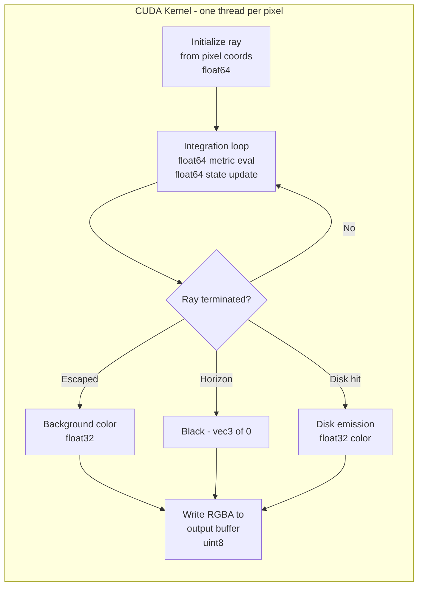
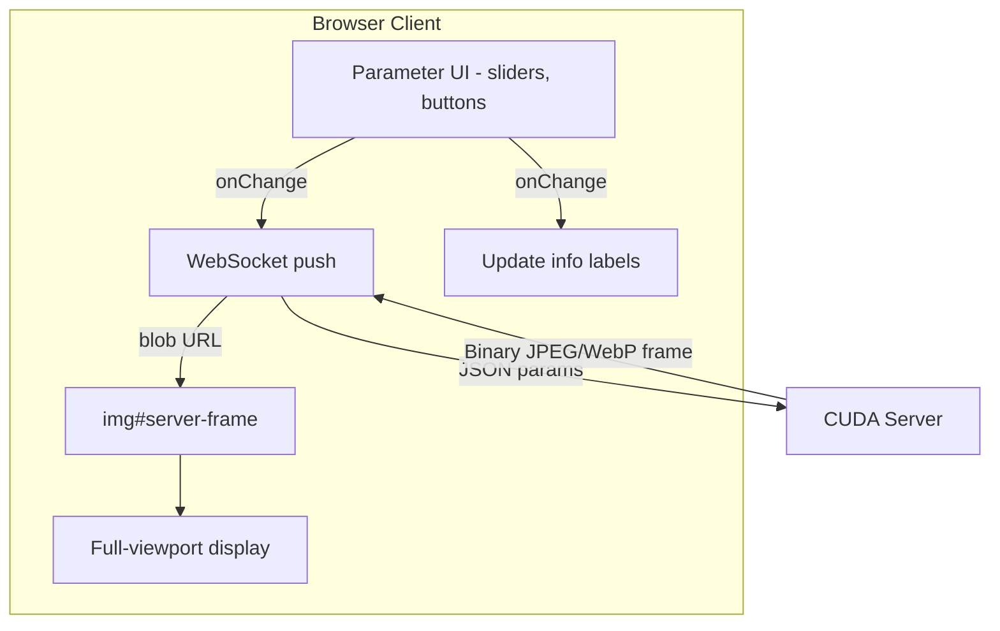
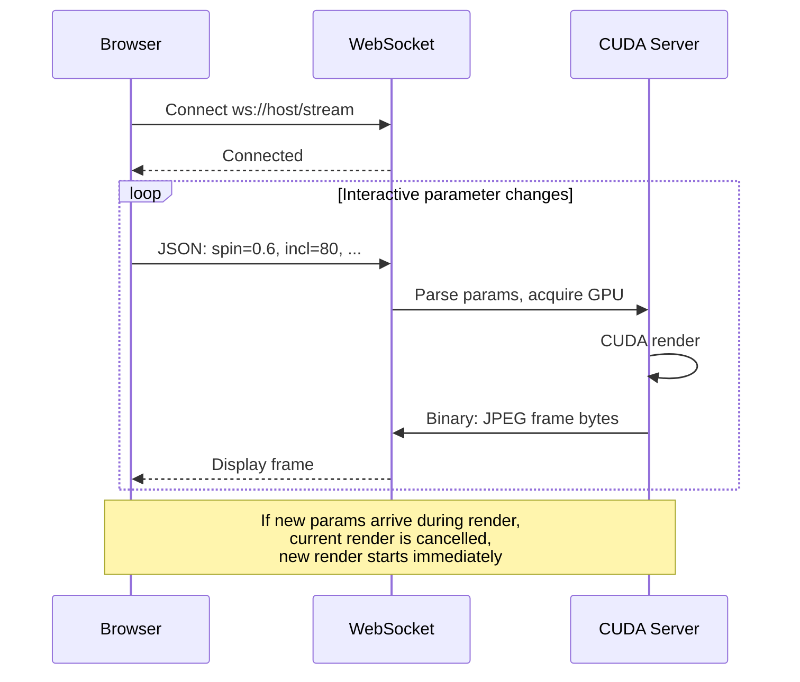
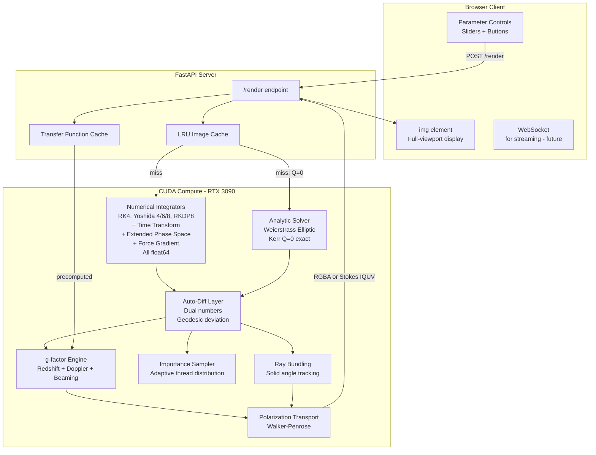

# Nulltracer: CUDA Migration & Advanced Techniques Plan

## Executive Summary

Migrate Nulltracer from a WebGL/OpenGL fragment shader architecture to a CUDA compute backend with float64 precision, then implement 9 advanced techniques for maximally accurate Kerr-Newman black hole raytracing. The browser becomes a thin image-viewer + parameter UI; all rendering moves to the RTX 3090 server.

---

## Phase 0: Foundation — CUDA Backend, WebGL Removal & WebSocket Streaming

### 0B: CUDA Compute Backend (FIRST — enables validation against existing OpenGL)

**Goal**: Build the CUDA compute backend alongside the existing OpenGL renderer so we can validate CUDA output against known-good OpenGL renders before removing anything.

**Library**: CuPy with `RawKernel` for rapid iteration and automatic kernel caching.

**Server directory structure (during validation period — both backends coexist)**:

```
server/
├── app.py                    # FastAPI — add /render_cuda endpoint alongside existing /render
├── renderer.py               # KEEP temporarily — existing EGL renderer for A/B validation
├── renderer_cuda.py          # NEW: CuPy kernel launcher
├── kernels/                  # NEW: CUDA kernel source files
│   ├── geodesic_base.cu      # Metric functions, geoRHS, shared utilities (float64)
│   ├── integrators/
│   │   ├── rk4.cu            # RK4 integrator kernel
│   │   ├── yoshida4.cu       # Yoshida 4th-order symplectic
│   │   ├── yoshida6.cu       # Yoshida 6th-order symplectic
│   │   ├── yoshida8.cu       # Yoshida 8th-order symplectic
│   │   └── rkdp8.cu          # Dormand-Prince adaptive 8th-order
│   ├── backgrounds.cu        # Background rendering (stars, checker, colormap)
│   └── disk.cu               # Accretion disk emission + color
├── shader_base.py            # KEEP temporarily for validation
├── shader.py                 # KEEP temporarily for validation
├── backgrounds.py            # KEEP temporarily for validation
├── integrators/              # KEEP temporarily for validation
├── isco.py                   # KEEP — ISCO calculation (pure Python, called before kernel launch)
├── cache.py                  # KEEP — LRU image cache
├── Dockerfile                # MODIFY — change base to nvidia/cuda (with OpenGL libs for validation)
└── requirements.txt          # MODIFY — add cupy alongside PyOpenGL temporarily
```

**CUDA kernel design**:



**Key design decisions**:
- **Mixed precision**: `float64` for all metric evaluation (`Sigma`, `Delta`, `geoRHS`) and integration state; `float32` for final color computation and output
- **Kernel launch**: One CUDA thread per pixel, 2D grid matching output resolution
- **Shared memory**: Integrator coefficients (Yoshida weights, RK tableaux) loaded into shared memory once per block
- **Library**: CuPy `RawKernel` for rapid iteration; automatic kernel caching by CuPy
- **Validation**: Add `/render_cuda` endpoint alongside existing `/render` — compare pixel-by-pixel for identical parameters, differences within float32 tolerance (~1e-6 relative)

**Dockerfile change (validation period)**:

```dockerfile
# OLD: FROM nvidia/opengl:1.2-glvnd-runtime-ubuntu22.04
# NEW:
FROM nvidia/cuda:12.2.0-devel-ubuntu22.04

# Keep OpenGL libs temporarily for A/B validation
RUN apt-get update && apt-get install -y libegl1 libgl1 && rm -rf /var/lib/apt/lists/*
```

Note: `devel` image needed for nvcc compiler (CuPy compiles kernels at runtime).

**requirements.txt change (validation period — both backends)**:

```
fastapi>=0.104.0
uvicorn[standard]>=0.24.0
cupy-cuda12x>=13.0.0      # NEW — CUDA compute backend
PyOpenGL>=3.1.7            # KEEP temporarily for A/B validation
PyOpenGL-accelerate>=3.1.7 # KEEP temporarily for A/B validation
Pillow>=10.0.0
numpy>=1.24.0
```

### 0A: Strip WebGL Client Rendering (AFTER CUDA backend is validated)

**Goal**: Convert the browser client from a WebGL renderer to a pure server-frame viewer with parameter controls. Also remove OpenGL code from server (validation complete).

**Client files to modify/remove**:

| File | Action | Notes |
|------|--------|-------|
| `js/webgl-renderer.js` | **Remove** | All WebGL init, shader compile, render loop |
| `js/shader-generator.js` | **Remove** | 50KB GLSL generator — no longer needed client-side |
| `js/isco-calculator.js` | **Remove** | ISCO computed server-side only |
| `js/main.js` | **Rewrite** | Remove WebGL init, keep server-client + UI wiring |
| `js/server-client.js` | **Modify** | Remove `local` mode, make `server` the default and only mode |
| `js/ui-controller.js` | **Modify** | Remove WebGL-dependent code, remove `recompile()`, remove resolution scaling |
| `index.html` | **Modify** | Remove `<canvas>`, remove vertex shader `<script>`, keep `` as primary display |
| `styles.css` | **Modify** | Remove canvas-related styles, make server-frame the primary element |

**Server files to remove (OpenGL backend no longer needed)**:

| File | Action | Notes |
|------|--------|-------|
| `server/renderer.py` | **Remove** | Old EGL/OpenGL renderer — replaced by `renderer_cuda.py` |
| `server/shader.py` | **Remove** | GLSL shader orchestrator |
| `server/shader_base.py` | **Remove** | GLSL shader base/header |
| `server/backgrounds.py` | **Remove** | GLSL background functions |
| `server/integrators/` | **Remove entire directory** | Python GLSL integrator generators |

**Rename**: `server/renderer_cuda.py` → `server/renderer.py` (becomes the sole renderer)

**Final requirements.txt (OpenGL removed)**:

```
fastapi>=0.104.0
uvicorn[standard]>=0.24.0
cupy-cuda12x>=13.0.0
Pillow>=10.0.0
numpy>=1.24.0
```

**Final Dockerfile (OpenGL libs removed)**:

```dockerfile
FROM nvidia/cuda:12.2.0-devel-ubuntu22.04
RUN apt-get update && apt-get install -y python3 python3-pip && rm -rf /var/lib/apt/lists/*
# No more libegl1, libgl1
```

**New client architecture**:



**Key decisions**:
- No local rendering fallback — server is required
- Loading state shows a spinner until first server frame arrives
- Primary transport is WebSocket (Phase 0C); HTTP `/render` kept for single high-quality renders
- Server URL auto-detected via same-origin `/health` probe (existing behavior)

### 0C: WebSocket Streaming for Interactive Parameter Exploration

**Goal**: Add WebSocket support for low-latency interactive rendering. When the user drags a slider, frames stream back in real-time without HTTP request/response overhead.

**Server side changes**:
- New WebSocket endpoint `ws /stream` in `server/app.py`
- Client sends JSON parameter updates over the WebSocket
- Server renders and pushes JPEG/WebP frames back over the same WebSocket as binary messages
- Server-side debouncing: if a new parameter update arrives while rendering, cancel current render and start new one
- Backpressure: if the client hasn't acknowledged the previous frame, don't queue more

**Client side changes**:
- New `js/ws-client.js` module replacing the HTTP-based `server-client.js`
- Opens WebSocket on page load (with reconnection logic)
- Slider `oninput` events push parameter JSON to WebSocket
- Incoming binary frames displayed directly in `img#server-frame` via `URL.createObjectURL(blob)`
- Falls back to HTTP POST `/render` if WebSocket connection fails

**Protocol**:



**Key design decisions**:
- Binary frames over WebSocket (not base64) for minimal overhead
- Server sends frame dimensions in an 8-byte header before image bytes: `[width:u16][height:u16][format:u8][reserved:u24]`
- Client maintains a single WebSocket connection; reconnects on drop with exponential backoff
- HTTP `/render` endpoint remains available for single high-quality renders (e.g., download/export)

---

## Phase 1: Core Accuracy Improvements

### 1A: Redshift & Beaming (Technique #8)

**Goal**: Implement physically accurate frequency shift factor `g = nu_obs / nu_emit` including gravitational redshift, Doppler boosting, and beaming.

**What changes**:
- New CUDA function `compute_g_factor()` in `kernels/disk.cu`
- Computes the disk 4-velocity (Keplerian circular orbit in Kerr-Newman)
- Dot product of photon 4-momentum with emitter 4-velocity gives `g`
- Intensity transforms as `I_obs = g^3 * I_emit` (optically thin) or `g^4 * I_emit` (optically thick)
- Replace current ad-hoc Doppler coloring with physics-based `g`-factor

**Validation**: Compare `g`-factor at known disk radii against analytic expressions from Cunningham (1975).

### 1B: Time Transformation (Technique #1 — Mikkola/Preto-Tremaine)

**Goal**: Regularize the geodesic equations near the horizon using a time transformation `ds = f(r) * d_lambda`.

**What changes**:
- New integrator variant in `kernels/integrators/` that uses the transformed independent variable
- The transformation function `f(r) = 1/Delta` (or similar) makes the RHS bounded everywhere
- Remove the ad-hoc step-size clamp `clamp((r-rp)*0.4, 0.04, 1.0)` from all integrators
- The Preto-Tremaine formulation extends the phase space by one dimension (time becomes a coordinate)
- Compatible with symplectic integrators — Yoshida methods can use the extended Hamiltonian

**Validation**: Compare geodesic endpoints (escape angle or disk hit radius) against Weierstrass exact solutions (Phase 2) for rays passing close to the photon sphere.

### 1C: Automatic Differentiation — Geodesic Deviation (Technique #9)

**Goal**: Implement forward-mode AD using dual numbers to propagate the geodesic deviation equation alongside the geodesic.

**What changes**:
- Define a `DualFloat64` type in CUDA: `struct Dual { double val; double d_alpha; double d_beta; };`
- All metric functions (`Sigma`, `Delta`, `geoRHS`) get dual-number overloads
- Each integration step propagates both the geodesic AND its derivatives with respect to initial ray direction (alpha, beta)
- Output per ray: position + 2x2 Jacobian matrix `d(r_disk, phi_disk) / d(alpha, beta)`
- The Jacobian determinant = magnification = 1/|det(J)|

**Design decision**: Implement AD at the kernel level, not as a Python code transformation. The dual number struct is defined in `geodesic_base.cu` and used by all integrators.

**Validation**: Compare AD-computed Jacobian against finite-difference Jacobian (trace 4 neighboring rays, compute numerical derivative). Agreement to ~12 digits confirms correctness.

---

## Phase 2: Exact Solutions & Advanced Integration

### 2A: Weierstrass Elliptic Function Solutions (Technique #3)

**Goal**: For Kerr (Q=0) geodesics, compute exact analytic solutions using Weierstrass elliptic functions.

**What changes**:
- New kernel module `kernels/analytic/weierstrass.cu`
- Implements Carlson symmetric elliptic integrals (RF, RJ, RD, RC) in float64
- Classifies geodesic type from conserved quantities (b, q) — determines root structure of radial/polar potentials
- Computes r(lambda), theta(lambda), phi(lambda) from elliptic functions
- Falls back to numerical integration for Q != 0

**New files**:

```
server/kernels/analytic/
├── weierstrass.cu        # Weierstrass P, zeta, sigma functions
├── carlson.cu            # Carlson symmetric elliptic integrals
├── geodesic_classify.cu  # Root classification for radial/polar potentials
└── kerr_analytic.cu      # Complete analytic geodesic solver
```

**Validation**: This IS the validation oracle. Compare against numerical integrators at various (a, theta_obs, alpha, beta) to quantify numerical error.

### 2B: Force-Gradient / Extended Phase Space (Technique #2)

**Goal**: Implement Wang-Huang-Wu extended phase space symplectic integrators for the non-separable Kerr-Newman Hamiltonian.

**What changes**:
- New integrator modules in `kernels/integrators/`:
  - `extended_yoshida4.cu` — 4th-order extended phase space
  - `extended_yoshida6.cu` — 6th-order extended phase space
  - `force_gradient4.cu` — 4th-order force-gradient method
- The extended phase space doubles the state vector: original (q, p) plus auxiliary (Q, P)
- Force-gradient methods require `d^2 H / dq^2` — computed via the AD infrastructure from Phase 1C
- These methods are exactly symplectic for the full non-separable Hamiltonian (unlike current Yoshida which assumes separability)

**Validation**: Monitor Hamiltonian conservation over long integrations. Extended phase space methods should conserve H to machine precision (float64 ~1e-15), vs current methods which drift.

---

## Phase 3: Advanced Rendering Techniques

### 3A: Transfer Functions (Technique #4)

**Goal**: Precompute the gravitational lens map for a given (a, Q, theta_obs), then render frames by lookup + emission model evaluation.

**What changes**:
- New CUDA kernel `kernels/transfer/precompute.cu` — traces a dense grid of rays, stores (r_disk, phi_disk, g_factor, magnification, n_crossings) per pixel
- New Python module `server/transfer.py` — manages transfer function computation, storage, and interpolation
- The transfer function is cached on disk (HDF5 or numpy .npz) keyed on (a, Q, theta_obs, fov, resolution)
- Rendering a frame with a new emission model becomes a simple 2D texture lookup — sub-millisecond

**New API endpoint**: `POST /render_transfer` — uses precomputed transfer function with a specified emission model

**Interaction with Phase 2A**: For Q=0, the transfer function can be computed analytically via Weierstrass solutions — no numerical integration needed.

### 3B: Importance Sampling (Technique #5)

**Goal**: Concentrate GPU threads on high-magnification regions (photon ring, caustics) using the Jacobian from Phase 1C.

**What changes**:
- Two-pass rendering pipeline:
  1. **Coarse pass**: Trace rays on a low-res grid, compute magnification from AD Jacobian
  2. **Adaptive pass**: Redistribute threads proportional to magnification, trace at sub-pixel resolution in high-magnification regions
- Requires parallel prefix sum (CUB library) for thread redistribution
- Output is a non-uniform sample set that gets splatted/accumulated into the final image

### 3C: Spectral Ray Bundling (Technique #6)

**Goal**: Track ray bundle cross-sections using geodesic deviation vectors from Phase 1C.

**What changes**:
- Each ray carries 2 deviation vectors (the bundle's principal axes) — already computed by AD
- Bundle solid angle = |cross product of deviation vectors| at each step
- Used for proper flux integration: `F = I * d_Omega` where `d_Omega` is the bundle solid angle
- Enables physically correct anti-aliasing without supersampling

### 3D: Polarization Transport (Technique #7)

**Goal**: Parallel-transport a polarization basis along each geodesic using the Walker-Penrose constant.

**What changes**:
- New CUDA function `compute_walker_penrose()` in `kernels/polarization.cu`
- For Kerr (Q=0): Walker-Penrose constant is exactly conserved — reconstruct polarization rotation from endpoints
- For Kerr-Newman (Q!=0): Modified Walker-Penrose with charge correction
- Output per pixel becomes a Stokes vector (I, Q, U, V) — 4 channels
- New API parameter: `polarization: bool` — when true, returns polarization map

**New files**:

```
server/kernels/
├── polarization.cu       # Walker-Penrose constant, parallel transport
```

---

## Target Architecture (All Phases Complete)



---

## Validation Strategy

Each phase includes validation against known results:

| Phase | Validation Method |
|-------|------------------|
| 0B (CUDA backend) | Pixel-diff against current OpenGL renders — must match within float32 tolerance |
| 1A (g-factor) | Compare against Cunningham 1975 Table I values |
| 1B (time transform) | Compare near-horizon geodesics against Weierstrass exact (Phase 2A) |
| 1C (auto-diff) | AD Jacobian vs finite-difference Jacobian — agree to ~12 digits |
| 2A (Weierstrass) | Self-validating — compare against numerical integrators |
| 2B (extended phase space) | Hamiltonian conservation to machine precision over 10^4 steps |
| 3A (transfer functions) | Transfer function renders vs direct ray-traced renders — pixel-identical |
| 3B (importance sampling) | Convergence rate comparison vs uniform sampling |
| 3C (ray bundling) | Flux conservation: total flux through image plane = total disk luminosity |
| 3D (polarization) | Walker-Penrose constant conservation along geodesic |
