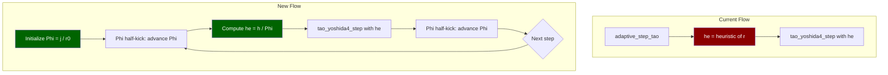

# Preto-Saha Φ Adaptive Step Size for Tao Integrators

## Overview

Replace the heuristic `adaptive_step_tao()` with the Preto-Saha Φ method (Wu et al. 2024), which provides **symplecticity-preserving adaptive time steps** for the Tao extended phase space integrators.

## Mathematical Foundation

### Current Approach (Broken)

```
he = h_scaled × clamp((r - rp) × 0.4, 0.04, 1.0)    // heuristic, NOT symplectic
```

### New Approach: Preto-Saha Φ Method

Following Wu et al. (2024), Eq. 15-26, and Preto & Saha (2009):

**Core idea**: Introduce an auxiliary conjugate momentum **Φ** that acts as a time-rescaling factor. Φ remains constant during the Tao step but is advanced before/after each step.

**The extended Hamiltonian** (Wu et al. Eq. 15):
```
F = K/Φ + g·ln(Φ/φ)
```
where:
- `K = g·(H + p₀)` is the time-transformed Hamiltonian
- `g(r,θ) = Σ/r²` is the Sundman time transformation function for Kerr
- `φ(r) = j/r` is the step-size control function
- `j` is a free parameter ≈ observer distance

**The adaptive step algorithm** AS₂ (Wu et al. Eq. 26, Point 2):

```
Step 1: Φ ← Φ - (h/2) · (g/r) · g^rr · p_r     // half-kick Φ
Step 2: τ ← τ + (h/2) · g/Φ                       // half-advance time
Step 3: Evolve (r, θ, p_r, p_θ) via Tao step       // with step size h/Φ
Step 4: τ ← τ + (h/2) · g/Φ                       // half-advance time
Step 5: Φ ← Φ - (h/2) · (g/r) · g^rr · p_r     // half-kick Φ
```

**Initial condition**: `Φ₀ = j/r₀` (from Eq. 21-22 with C=1)

**Physical step size**: `he = h/Φ` where `h` is the fixed new-time step

### Adaptation to Kerr Coordinates

Since we already ported the Tao integrators to ingoing Kerr coordinates, the Φ update uses KS metric components:

In KS coordinates:
- `g^rr` is not needed directly — we use the KS velocity `dr/dλ`
- The Φ update becomes: `dΦ/ds = -(g/r) · (dr/dτ)` where `dr/dτ = dr/dλ · (1/g)`
- Simplifying: `dΦ/ds = -(1/r) · dr/dλ`

In KS coordinates, `dr/dλ = [Δ·p_r + a·b - (r²+a²)] / Σ` (from `geoVelocityKS`).

So the Φ half-kick is:
```
Φ += -(h/2) · (1/r) · [Δ·p_r + a·b - (r²+a²)] / Σ
```

## Architecture



## File Changes

### 1. `adaptive_step.cu` — Add Φ initialization and update functions

Add two new device functions:

```c
// Initialize Φ from observer position
__device__ double preto_saha_init_phi(double r, double obs_dist) {
    return obs_dist / r;  // Φ₀ = j/r₀ with j = obs_dist
}

// Half-kick Φ (called before and after each Tao step)
// Returns updated Φ
__device__ double preto_saha_kick_phi(
    double Phi, double h, double r, double th,
    double pr, double a, double b, double Q2
) {
    // Compute dr/dλ from KS velocity
    double dr_dlambda;
    double dth_dummy, dphi_dummy;
    geoVelocityKS(r, th, pr, 0.0 /* pth not needed for dr */,
                   a, b, Q2, &dr_dlambda, &dth_dummy, &dphi_dummy);
    
    // dΦ/ds = -(1/r) · dr/dλ
    // Half-kick: Φ += (h/2) · dΦ/ds
    return Phi - 0.5 * h * dr_dlambda / r;
}
```

### 2. `tao_yoshida4.cu`, `tao_yoshida6.cu`, `tao_kahan_li8.cu` — Update integration loop

Replace:
```c
double he = adaptive_step_tao(r, rp, p.step_size, p.obs_dist);
```

With:
```c
// Φ half-kick (before step)
Phi = preto_saha_kick_phi(Phi, h_fixed, r, th, pr, a, b, Q2);

// Physical step size from Φ
double he = fmin(fmax(h_fixed / Phi, 0.005), 0.2 * p.obs_dist);
```

And after the Tao step + projection:
```c
// Φ half-kick (after step)
Phi = preto_saha_kick_phi(Phi, h_fixed, r, th, pr, a, b, Q2);
```

Initialize before the loop:
```c
// Fixed new-time step (from geodesic budget, like sundman_dtau)
double h_fixed = sundman_dtau(a, Q2, rp, p.step_size, p.esc_radius, STEPS);
// But scale by obs_dist since Φ will handle the r-dependent scaling
// Actually: h_fixed should be the total new-time budget / STEPS

// Initialize Φ
double Phi = preto_saha_init_phi(r, p.obs_dist);
```

### 3. `ray_trace.cu` — Same changes for all 3 Tao ray_trace entry points

Mirror the render kernel changes.

### 4. `steps.cu` — No changes needed

The Tao step functions already accept `he` as a parameter. The Φ method only changes how `he` is computed.

## Key Design Decisions

### Choice of j parameter

Wu et al. recommend `j ≈ observer distance` for ray-tracing (Section 3.2.2). This maps directly to `p.obs_dist` in our code.

### Choice of h_fixed

The fixed new-time step `h` should be derived from the geodesic budget, similar to `sundman_dtau()`. The total new-time budget is:
```
s_total = ∫ dλ / (g · Φ) ≈ ∫ dλ · r / (Σ · j)
```

For practical purposes, we can reuse the `sundman_dtau()` computation but adjust for the Φ scaling. The simplest approach: use `h_fixed = sundman_dtau(...)` since the Φ rescaling will handle the r-dependent part.

### Clamping

The physical step `he = h_fixed / Φ` should be clamped:
- Minimum: `0.005` (prevent vanishing steps)
- Maximum: `0.2 × obs_dist` (prevent overshooting)

This matches the existing `sundman_physical_step()` clamping.

### Interaction with Tao coupling

The Tao rotation angle `2·ω·δ` where `ω = TAO_OMEGA_C / h` depends on the step size `h`. With the Φ method, `h = he = h_fixed / Φ` varies per step. The rotation angle computation in the step functions already uses `he` correctly — the angle is `2·TAO_OMEGA_C·γ` which is independent of `he`. So no changes needed to the rotation logic.

## Testing Strategy

1. **Single-ray comparison**: Use `/ray` endpoint to compare Tao+Φ vs rkdp8 for rays at various impact parameters (beta = 5.0, 5.3, 5.5, 6.0) with a=0, Q=0, θ=89°
2. **Visual comparison**: Render full frames and compare against rkdp8 reference
3. **Spinning BH test**: Verify with a=0.6, θ=80° (the default parameters)
4. **Step-size distribution**: Log the physical step sizes to verify the desired stretching/shrinking behavior
