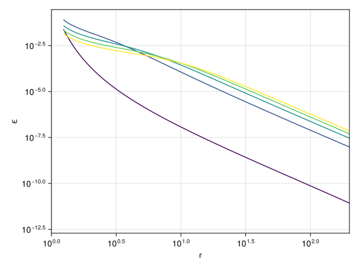
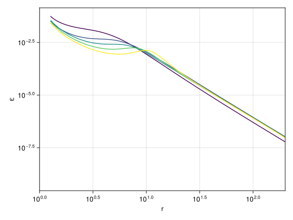
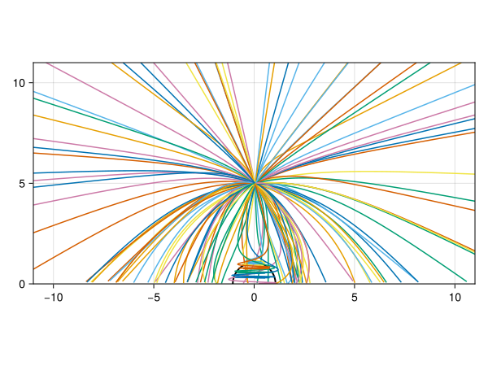
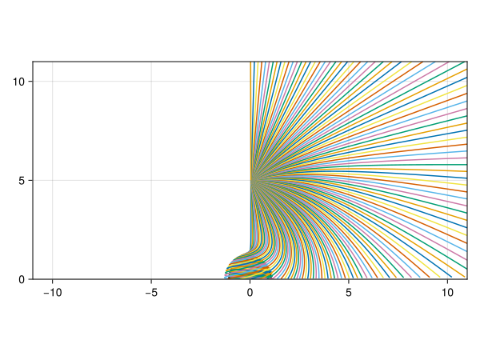
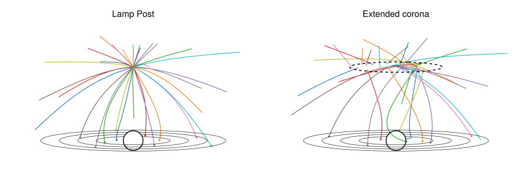

# Emissivity and illumination profiles

```@meta
CurrentModule = Gradus
```

Calculating emissivity profiles can be achieved with the
[`emissivity_profile`](@ref) function:

```julia
using Gradus, Makie, CairoMakie

m = KerrMetric(1.0, 0.998)
d = ThinDisc(Gradus.isco(m), 1000.0)
# a range of lamppost heights
models = [LampPostModel(h = h) for h in range(Gradus.isco(m), 10, 5)]

profiles = emissivity_profile.(m, d, models)

# a radial grid to calculate the emissivity at
radii = collect(logrange(Gradus.isco(m), 1e3, 300))

# from here it's plotting
fig = Figure()
ax = Axis(fig[1,1])
xlims!(ax, 1, 200)
for prof in profiles
    em = emissivity_at(prof, radii)
    mask = @. em > 0
    lines!(ax, radii[mask], em[mask], color = model.h, colorrange = (1, 10))
end
fig
```



The emissivity profile of an extended source is best constructed out of many
ring-like coronae. Although the axis-symmetry is broken, we can take a
'time-averaged' look at the emissivity profiles as a function of radius:

```julia
models = [RingCorona(h = 4.0, r = r) for r in range(1.0, 10.0, 5)]
profiles = emissivity_profile.(m, d, models; verbose = true)
```



## Time-dependent emissivity profiles

The time-dependent emissivity profiles are a way of encapsulating information
about the timing properties of an emissivity profile. The idea is similar to
the reverberation transfer functions, where the emissivity is plotted over both
disc radius and time, and the colouring is the emissivity. The works as the
time coordinate is a proxy for the angular coordinate (see [Baker, 2025, PhD
thesis](https://cosroe.com/thesis)).

## Calculating emissivity profiles

```@docs
emissivity_profile
```

As an example of the type of optimisations that may be performed, consider the
lamppost model. The Monte-Carlo approach would be to sample all angles on the
local sky of the corona evenly:

```julia
import Random
Random.seed!(42)

m = KerrMetric(1.0, 0.998)
d = ThinDisc(0.0, Inf)
model = LampPostModel(h = 5.0)

sampler = EvenSampler(BothHemispheres(), RandomGenerator())
xs, vs, _ = Gradus.sample_position_direction_velocity(
    m, model, sampler, 128
)
sols = tracegeodesics(
    m,
    xs,
    vs,
    d,
    1024.0;
    save_on = true,
)

function plot_paths(sols)
    # from here on it's plotting code
    all_points = extract_path.(sols.u, 1024; t_span = 1024.0)

    fig = Figure()
    ax = Axis(fig[1,1], aspect = DataAspect())
    xlims!(-11, 11)
    ylims!(0, 11)
    arc!(ax, (0.0, 0.0), Gradus.inner_radius(m), 0.0, 2π, color = :black, linewidth = 2.0)
    for (x, y, z) in all_points
        lines!(ax, x, z)
    end
    fig
end

plot_paths(sols)
```



We would then count the number of photons in some azimuthal bin $r + \Delta r$
to estimate the Jacobian term in the emissivity. Instead, it could be estimated
using automatic differentiation along the geodesic, and the axis symmetry of
the model could then be more readily exploited:

```julia
src_x, src_v = Gradus.sample_position_velocity(m, model)
vs = map(range(0.0, π, 128)) do δ
    Gradus.sky_angles_to_velocity(m, src_x, src_v, δ, π)
end
xs = fill(src_x, size(vs))
sols = tracegeodesics(
    m,
    xs,
    vs,
    d,
    1024.0;
    save_on = true,
)

plot_paths(sols)
```



This samples the radial coordinate much better than a Monte-Carlo approach
would, and calculates the emissivity to higher precision with fewer photons.

## Photon fractions

The photon fraction is the fraction of photons that either intersect the
accretion disc, go to infinity, or fall into the black hole. It is formally a
fraction of the total sky of the corona, and therefore is normalised as a
fraction ``1 / 4 \pi``.

In Gradus.jl, these fractions may be calculated using
[`photon_fractions`](@ref). An example for different lamppost coronal heights:

```julia
m = KerrMetric(1.0, 0.998)
d = ThinDisc(0.0, Inf)
heights = collect(logrange(Gradus.inner_radius(m) * 1.05, 50.0, 50))
fracs = map(heights) do h
    corona = LampPostModel(; h = h)
    photon_fractions(m, d, corona)
end
```

This can then be visualised:

```julia
fig = Figure()
ax = Axis(fig[1, 1], xscale = log10, xlabel = "height", ylabel = "fraction")
lines!(ax, heights, getproperty.(fracs, :disc), label = "disc")
lines!(ax, heights, getproperty.(fracs, :black_hole), label = "black hole")
lines!(ax, heights, getproperty.(fracs, :infinity), label = "infinity")
axislegend(ax; position = (:center, :top), orientation = :horizontal)
fig
```


```@docs
photon_fractions
PhotonFractions
```

## Coronal models

```@docs
LampPostModel
BeamedPointSource
RingCorona
DiscCorona
```

## Adding new coronal models

A coronal model must minimally specify how pairs of source position and velocity are to be sampled. For example, the lamp post model has only a single position (the point location), and is stationary. A stationary extended corona has different positions, but always the same velocity, and a moving extended source has both a position and velocity distribution which must be sampled to calculate the emissivity profile:



Coronal sources must subtype [`AbstractCoronaModel`](@ref):

```@docs
AbstractCoronaModel
sample_position_velocity
```

## Samplers

In the above example an [`EvenSampler`](@ref) is used to evenly sample the sky
of a point. Gradus.jl provides interfaces for constructing a number of
different samplers:

```@docs
AbstractDirectionSampler
geti
sample_azimuthal
sample_elevation
sample_angles
EvenSampler
WeierstrassSampler
```
