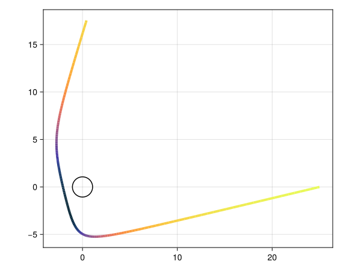

# Energy shift calculations

!!! note

    The term often used in the literature for any arbitrary energy shift is
    _redshift_, regardless of whether there is an increase in energy (a blueshift)
    or a decrease (redshift). The term _redshift_ therefore refers the phenomena,
    but is generally otherwise misleading. The Gradus.jl authors are transitioning
    to update the code to refer to the _energy shift_ instead, but for
    compatibility reasons this will take time.

The energy shift along a single geodesic may be calculated as follows, using
[`unpack_solution`](@ref) to obtain a [`GeodesicPoint`](@ref):

```@example energyshift
using Gradus

m = KerrMetric(a = 0.998)
x_start = SVector(0.0, 10.0, deg2rad(30), 0.0)
v = map_impact_parameters(m, x_start, 1.0, 1.0)

# integrate for 3 affine times, as an illustration
gp = tracegeodesics(m, x_start, v, 3.0) |> unpack_solution

# Energy shift as measured by a stationary observer at `x_start`
g = energyshift(m, gp)
```

```@docs
energyshift
```

To calculate the redshift along a geodesic, similar code may be used
```julia
sol = tracegeodesics(m, x_start, v, 80.0; save_on = true)

points = unpack_solution_full(m, sol)
gs = energyshift.(m, points)

using Makie, CairoMakie
fig = Figure()
ax = Axis(fig[1,1], aspect = DataAspect())
X = [p.x[2] * cos(p.x[4]) * sin(p.x[3]) for p in points]
Y = [p.x[2] * sin(p.x[4]) * sin(p.x[3]) for p in points]
lines!(ax, X, Y, color = log10.(abs.(gs)), colormap = :thermal, linewidth = 4.0)
arc!(ax, Point2f(0), Gradus.inner_radius(m), -π, π, color = :black)
fig
```



For calculating energy shifts from accretion discs, a number of utility
functions exist.

```@docs
redshift_function
RedshiftFunctions.keplerian_orbit
```
